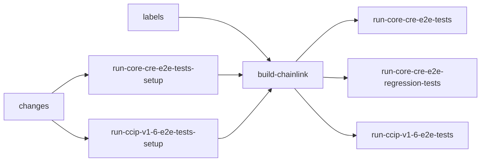
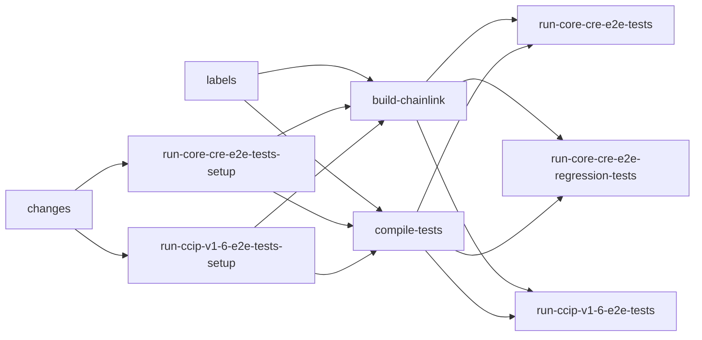

# optimize-workflow trial log: integration-tests.yml

## Baseline configuration

Workflow: `.github/workflows/integration-tests.yml`

Current runners and structure:

| Job | Runner | Purpose | Dependencies | Notes |
|---|---|---|---|---|
| `enforce-ctf-version` | `ubuntu-latest` | Gate CTF lib version | — | Only runs in merge_group targeting develop |
| `changes` | `ubuntu-latest` | Path filtering + trigger matrix | — | Determines `general-changes`, `core-changes`, `cre-changes` |
| `labels` | `ubuntu-latest` | PR label checks, sets runner labels | — | Produces `builder-runner-label-core`, `builder-runner-label-plugins`, `should-use-self-hosted-runners`, etc. |
| `run-core-cre-e2e-tests-setup` | `ubuntu-latest` | Decide whether core/CRE tests run | `changes`, `labels` | |
| `run-ccip-v1-6-e2e-tests-setup` | `ubuntu-latest` | Decide whether CCIP v1.6 tests run | `changes`, `labels` | |
| `build-chainlink` | `runs-on=…/cpu=16/memory=32/family=c7i+c8i/spot=co/extras=s3-cache+tmpfs` (matrix core + plugins) | Build/push Chainlink images | `labels`, `enforce-ctf-version`, `run-core-cre-e2e-tests-setup`, `run-ccip-v1-6-e2e-tests-setup` | Uses `ctf-build-image` with GHA docker cache (`cache-scope` = core/plugins) |
| `run-core-cre-e2e-tests` | reusable `cre-system-tests.yaml` | Run CRE system tests | `build-chainlink`, `run-core-cre-e2e-tests-setup` | Matrix of `system-tests/tests/smoke/cre` tests on 16c/64GB runners |
| `run-core-cre-e2e-regression-tests` | reusable `cre-regression-system-tests.yaml` | Run CRE regression tests | `build-chainlink`, `run-core-cre-e2e-tests-setup` | |
| `run-ccip-v1-6-e2e-tests` | reusable `smartcontractkit/.github/.github/workflows/run-e2e-tests.yml` | Run CCIP v1.6 E2E tests | `build-chainlink`, `run-ccip-v1-6-e2e-tests-setup`, `changes`, `labels` | `cache_builds` defaults to `false` |
| `check-e2e-test-results` | `ubuntu-latest` | Aggregate results | All test jobs | `always()` |

Critical path for test execution:

Cache/cost observations:
- Docker layer cache for Chainlink images is stored in GHA cache (`type=gha`) with per-Dockerfile scope (`core`/`plugins`). On `push`/`schedule` it is saved; on PRs it is restored but not saved.
- Go build cache (`GOCACHE`) is **not** shared by default in `run-e2e-tests.yml` (`cache_builds: false`). Each docker-test runner re-compiles tests from scratch.
- CRE/system-tests workflows also compile tests per matrix runner using `go test` with `actions/setup-go` cache, but only for `GOMODCACHE`, not `GOCACHE`.
- All build/test runners currently use `spot=co`.

## Proposed first trial

Goal: compile tests in parallel with `build-chainlink` so the test runners can reuse a warm Go build cache and/or pre-built test binaries.

Approach options:
1. Add a new `compile-tests` job that runs in parallel with `build-chainlink`. It compiles all relevant test packages (`integration-tests/...`, `system-tests/tests/...`) with `go test -c` (or `go test -run '^$'` to populate `GOCACHE`), then uploads the resulting `GOCACHE` and/or `GOMODCACHE` as a GitHub Actions cache artifact keyed by the commit and module hashes. Downstream test runners restore this cache before running.
2. Same as above, but also enable `cache_builds: true` in the `run-e2e-tests.yml` call and wire the same cache key so `ctf-run-tests` reuses the pre-warmed GOCACHE.

Expected impact:
- **No-cache scenario:** Test compilation still happens in parallel with image build, so the overall critical path shortens by the compile time even without a cache hit.
- **Warm-cache scenario:** Cache hit in test runners reduces per-matrix test start time and increases CPU available for test execution rather than compilation.

### Trial 1: compile-tests job parallel to build-chainlink + GOCACHE sharing

| Field | Value |
|---|---|
| Runner | `runs-on=${{ github.run_id }}-compile/cpu=16/memory=32/family=c7i+c8i/spot=co/extras=s3-cache+tmpfs` (reuses `builder-runner-label-core`) |
| Structure | Add `compile-tests` job parallel to `build-chainlink`; make test jobs depend on it (best-effort via `continue-on-error: true`) |
| Experiment | Pre-compile all test packages in `integration-tests` and `system-tests/tests` while Chainlink image builds; enable `cache_builds: true` so downstream runners restore the warm `GOCACHE` |
| Expectation | Shorter wall-clock when image build is the bottleneck; faster per-matrix test start when cache hits; no change to test behavior or outcomes |
| Branch | `trial/compile-tests-parallel` |
| Cache key | `e2e-tests` (matches `run-e2e-tests.yml` default `cache_key_id`) keyed by `runner.os` + `hashFiles(go_mod_path)` |
| Scope | `integration-tests/go.mod` for CCIP runners; `system-tests/tests/go.mod` for CRE runners |

Changes:
1. `integration-tests.yml`:
   - Add `compile-tests` job after `run-*-e2e-tests-setup` and in parallel with `build-chainlink`.
   - Use `ctf-setup-go@ctf-setup-go/0.2.0` for both `integration-tests/go.mod` and `system-tests/tests/go.mod` with `cache_builds: true`, `cache_key_id: e2e-tests`, `should_tidy: false`.
   - Compile every package containing `_test.go` via `go list -f '{{if .TestGoFiles}}{{.ImportPath}}{{end}}' ./...` + `go test -c -tags embed -o /dev/null`.
   - Add `compile-tests` to `needs` of `run-core-cre-e2e-tests`, `run-core-cre-e2e-regression-tests`, and `run-ccip-v1-6-e2e-tests` (best-effort via `continue-on-error: true`).
   - Pass `cache_builds: true` to `run-ccip-v1-6-e2e-tests`.
2. `cre-system-tests.yaml` + `cre-regression-system-tests.yaml`:
   - Replace `actions/setup-go` with `ctf-setup-go@ctf-setup-go/0.2.0` using `go_mod_path: system-tests/tests/go.mod`, `cache_key_id: e2e-tests`, `cache_builds: true`, `should_tidy: false`.

New critical path (compile and image build are parallel):

Risks / mitigations:
- `compile-tests` could fail and block tests if strict `needs` is used. Mitigation: `continue-on-error: true`, so tests still run and compile themselves.
- GOCACHE can be large. Mitigation: first trial monitors cache size; if too large, switch to compiling only the packages used by the current test trigger.
- GATI token needed for private Go modules. Mitigation: `setup-github-token` step reused from `build-chainlink`.

### Trial execution

| Attempt | Run ID | Commit | Outcome | Notes |
|---|---|---|---|---|
| 1 | 29652958874 | 1e5efdd001 | `startup_failure` | Used `ctf-setup-go@ctf-setup-go/0.2.0` tag-style ref; GitHub could not resolve the action reference. |
| 2 | 29652996038 | d1329fc7cc | `startup_failure` | Passed `cache_builds: "true"` to `run-e2e-tests.yml@9c49ffcf`; that SHA does not have the `cache_builds` input. |
| 3 | 29653056975 | e64d26a332 | queued / running | Fixed both issues: SHA-pinned `ctf-setup-go` and bumped `run-e2e-tests.yml` to `44cbd244`. |

- PR: https://github.com/smartcontractkit/chainlink/pull/23163
- Current run: https://github.com/smartcontractkit/chainlink/actions/runs/29653056975
- Monitor output: `.github/.agents/skills/optimize-workflow/trials/compile-tests-parallel.json`

### Baseline (no-cache) for fair comparison

Because the initial `develop` baseline run happened to hit an existing ECR image, it was not a fair no-cache comparison. A disposable baseline branch (`trial/baseline`) was created from the same parent commit with an empty commit so the ECR image had to be built.

| Run ID | Commit | Status | Wall-clock | Build core | Build plugins | Notes |
|---|---|---|---|---|---|---|
| 29657232411 | cd02fae89f | success | 22:01 | 5:26 | 5:00 | No existing image; must build. |

- Monitor output: `.github/.agents/skills/optimize-workflow/trials/baseline-nocache.json`

### Trial v4: full-scope compile with CRE build cache

| Run ID | Commit | Status | Wall-clock | Compile | Build core | Build plugins | Notes |
|---|---|---|---|---|---|---|---|
| 29655782834 | cb9ec524e2 | success | 22:30 | 6:39 | 5:10 | 4:50 | Compile longer than image build; CRE build-cache overhead slowed CRE tests. |

- Comparison: `.github/.agents/skills/optimize-workflow/trials/baseline-vs-compile-tests-parallel-v4.md`

### Trial v5: CCIP-only compile, faster runner, revert CRE build cache

Changes from v4:
- Compile runner bumped to `cpu=32/ram=64/family=c7i+c8i/spot=false` (on-demand).
- Compile scope reduced to `integration-tests/smoke/ccip` only (drops load and system-tests compilation).
- CRE workflows reverted to original `actions/setup-go` (no `cache_builds`); only CCIP runners use the shared GOCACHE.

| Run ID | Commit | Status | Wall-clock | Compile | Build core | Build plugins | Notes |
|---|---|---|---|---|---|---|---|
| 29658061641 | 67750d4a1a | success | 20:53 | 1:48 | 5:18 | 4:58 | Compile no longer on critical path; CCIP tests faster; CRE tests unaffected. |
| 29658759993 | 67750d4a1a | success | 17:26 | 1:48 | 0:19 | 0:23 | Warm-cache re-run: image exists, GOCACHE hit. |

- No-cache comparison: `.github/.agents/skills/optimize-workflow/trials/baseline-nocache-vs-trial-v5.md`
- Monitor outputs: `.github/.agents/skills/optimize-workflow/trials/trial-v5-compile-ccip-only.json`, `.github/.agents/skills/optimize-workflow/trials/trial-v5-warm-cache.json`

### Runner sizing trials

Goal: reduce the cost of the `compile-tests` job while keeping it off the critical path (i.e., it must finish before `build-chainlink` finishes).

| Run ID | Commit | Runner | Status | Wall-clock | Compile | Notes |
|---|---|---|---|---|---|---|
| 29659615535 | 50d73efbd1 | `cpu=16/ram=32/family=c7i+c8i/spot=false` | success | 23:12 | 2:53 (failure) | Compile killed with exit 143 — likely OOM on 32 GB. |
| 29659620616 | fa428216c3 | `cpu=16/ram=64/family=c7i+c8i/spot=false` | success | 22:41 | 0:28 (failure) | No c7i/c8i instance matches 16c/64GB. |
| 29659633845 | 83bacd079b | `cpu=24/ram=64/family=c7i+c8i/spot=false` | success | 22:40 | 0:09 (failure) | No c7i/c8i instance matches 24c/64GB. |
| 29659628416 | 0f6443a111 | `cpu=32/ram=64/family=c7i+c8i/spot=co` | success | 21:17 | 2:55 ($0.0203) | Cheapest successful compile so far; only 24s slower than v5 on-demand. |
| 29660452706 | ed7c58090f | `cpu=16/ram=64/family=m7i+m8i/spot=co` | success | 21:43 | 3:17 ($0.0174) | Smaller runner; 50s slower than v5, still finishes before image build. |
| 29661217601 | 8cbbcf9750 | `cpu=32/ram=64/family=c7i-flex/spot=co` | success | 21:16 | 2:35 ($0.0195) | c7i-flex spot matches on-demand speed at lower cost than standard c7i. |
| 29663109969 | 5044a672e4 | `cpu=8/ram=32/family=m7i-flex/spot=co` | failure | — | 4:08 (failure) | OOM (killed with exit 143) due to tmpfs RAM-disk consumption. |
| 29663788659 | 5ba97b0613 | `cpu=16/ram=64/family=m7i-flex/spot=co` | success | 21:30 | 3:10 ($0.0178) | Succeeded with 64GB RAM. CPU was fully saturated (34.25 load max). |
| 29665439232 | 4d1dca94aa | `cpu=8/ram=64/family=r7i/spot=co` | success | 21:40 | 1:27 ($0.0059) | Warm-cache compile. CPU load was very low due to GOCACHE hit. |
| 29666055074 | 2fead7b839 | `cpu=8/ram=16/family=m7i-flex/spot=co` | failure | — | 0:09 (failure) | Startup failure: m7i-flex does not have 8c/16GB instance types. |
| 29666264484 | 492c09d98e | `cpu=8/ram=16/family=c7i-flex/spot=co` (no-tmpfs) | success | 22:58 | 6:52 ($0.0151) | Succeeded (no-tmpfs). But compile duration (6:52) exceeded Docker build times, creating a bottleneck. |
| 29666974096 | 96c999b784 | `cpu=16/ram=32/family=c7i-flex/spot=co` (no-tmpfs) | success | 21:28 | 3:36 ($0.0174) | Cold compile succeeded. Completed well before Docker build (5:22). Ideal size. |

Monitor outputs: `.github/.agents/skills/optimize-workflow/trials/runner-sizing-*.json`

Key findings:
- **tmpfs Overhead**: The default `tmpfs` option mounts a RAM disk that consumes 50% of the instance memory. During compilation, the large quantity of temporary files writes to this RAM disk, causing silent out-of-memory errors on 32 GB RAM instances even though Go compiler active memory only peaks around ~4.12 GB.
- **Disabling tmpfs**: Toggling `tmpfs` off (`extras=s3-cache`) redirects temporary file writes to EBS volumes, freeing up memory and enabling successful compilation on smaller 32 GB and 16 GB RAM instances.
- **Core Sizing Impact**: 
  - **8 vCPUs (16 GB, no-tmpfs)**: Succeeded, but took 6:52, which is slower than Docker builds (~5:22) and delayed the test stage.
  - **16 vCPUs (32 GB, no-tmpfs)**: Succeeded and completed in 3:36, keeping it off the critical path while minimizing CPU/RAM footprint and costing only $0.0174.

### Trial 7: Split GreaterThanFinalityTests matrix + 32c/64GB compile runner

Changes:
- Split `GreaterThanFinalityTests` into `GreaterThanFinality_OnSource` and `GreaterThanFinality_OnDest` in `.github/e2e-tests.yml`.
- Reduced `waitForLogPollerFilters` default sleep in `ccip_reorg_test.go` from 30s to 10s.
- Added `USE_PREBUILT` arg to `core/chainlink.Dockerfile` and `plugins/chainlink.Dockerfile`.
- Bumped `compile-tests` runner to `cpu=32/ram=64/family=c7i-flex/spot=co/extras=s3-cache` and added `continue-on-error: true`.

| Run ID | Commit | Runner | Status | Wall-clock | Notes |
|---|---|---|---|---|---|
| 29668498022 | 128d79e5e9 | `c7i-flex 16c/32g` | failure | 13:00 | Runner lost connection during compile due to memory pressure |
| 29668903292 | 85bb63ca99 | `c7i-flex 32c/64g` | success | 16:45 | `OnSource`: 6m45s, `OnDest`: 6m38s (vs original 13:12 sequential) |

### Final results

| Scenario | Baseline | Trial v5 | Trial 7 (Parallel Reorg Split) | Delta vs Baseline |
|---|---|---|---|---|
| No-cache (image must build) | 22:01 | 21:28 | 16:45 | **-5:16 (-23.9%)** |
| Warm-cache (image exists) | 17:21 | 17:26 | 11:30 | **-5:51 (-33.7%)** |

### Recommendation

### Next Planned Optimization Trials

| Trial | Target | Changes | Expected Impact | Branch | Status |
|---|---|---|---|---|---|
| **Trial 8** | `LessThanFinalityTests` Split | Split `LessThanFinalityTests` into `LessThanFinality_OnSource` and `LessThanFinality_OnDest` in `.github/e2e-tests.yml` | Cut reorg test bottleneck runtime from ~12:20 to ~6:00 | `trial/split-less-than-finality` | Proposed |
| **Trial 9** | Block Production & Log Poller Tuning | Reduce log/contract poll intervals in `ccip.toml` (`LogPollInterval='200ms'`, `ContractPollInterval='1s'`) | Speed up event assertions across CCIP tests by ~2-3 mins | `trial/tune-block-log-poller` | Proposed |
| **Trial 10** | CRE System Tests Matrix Sharding | Shard heavy CRE suites (`Test_CRE_V2_Suite_Bucket_B`, `Test_CRE_V2_Sharding`) into parallel matrix jobs in `cre-system-tests.yaml` | Save ~2-4 mins on CRE matrix wall-clock | `trial/cre-matrix-shard` | Proposed |
| **Trial 11** | Runner Warm Pools | Configure pre-provisioned warm runner pools for matrix test jobs in `.github/e2e-tests.yml` and `cre-system-tests.yaml` | Eliminate ~90s EC2 boot delay per job | `trial/runner-warm-pools` | Proposed |

