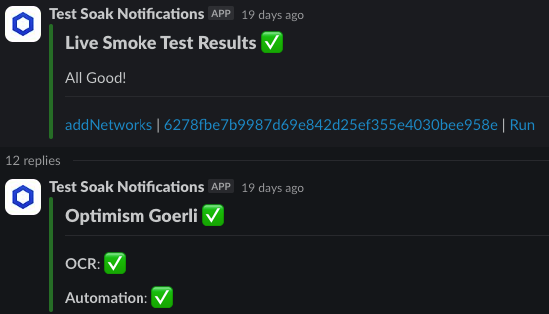

# Notify Slack Jobs Result

Sends a Slack message to a specified channel detailing the results of one to many GHA job results using a regex. The job results will be grouped by the `github_job_name_regex` and displayed underneath the `message_title`, with the regex matching group displayed as an individual result. This is primarily designed for when you have test groups running in a matrix, and would like condensed reporting on their status by group. It's often accompanied by posting a Slack message before to start a thread, then attaching all the results to that thread like we do in the reporting section of the [live-testnet-test.yml workflow](../../workflows/live-testnet-tests.yml). Check out the example below, where we post an initial summary message, then use this action to thread together specific results:

```yaml
message_title: Optimism Goerli
github_job_name_regex: ^Optimism Goerli (?<cap>.*?) Tests$ # Note that the regex MUST have a capturing group named "cap"
```



## Inputs

```yaml
inputs:
  github_token:
    description: "The GitHub token to use for authentication (usually ${{ github.token }})"
    required: true
  github_repository:
    description: "The GitHub owner/repository to use for authentication (usually ${{ github.repository }}))"
    required: true
  workflow_run_id:
    description: "The workflow run ID to get the results from (usually ${{ github.run_id }})"
    required: true
  github_job_name_regex:
    description: "The regex to use to match 1..many job name(s) to collect results from. Should include a capture group named 'cap' for the part of the job name you want to display in the Slack message (e.g. ^Client Compatability Test (?<cap>.*?)$)"
    required: true
  message_title:
    description: "The title of the Slack message"
    required: true
  slack_channel_id:
    description: "The Slack channel ID to post the message to"
    required: true
  slack_thread_ts:
    description: "The Slack thread timestamp to post the message to, handy for keeping multiple related results in a single thread"
    required: false
```
