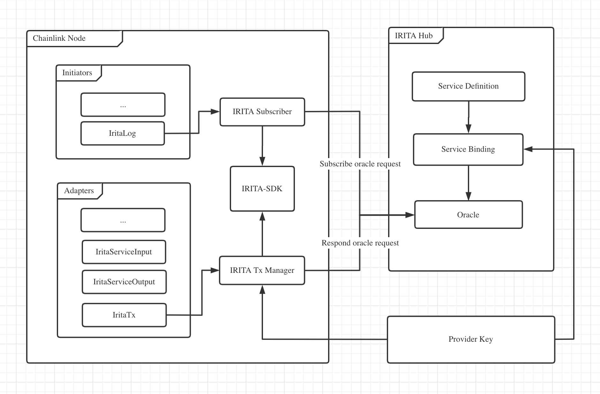

# Add IRITA Support for Chainlink

## Architecture

Architecture



Workflow


### Initiators

**iritalog**

Subscribe service request on IRITA Hub, start the job when a qualified request is monitored.

- `params`
  - `serviceName`: service name to subscribe
  - `serviceProvider`: service provider to subscribe

### Adapters

**IritaServiceInput**

Parsing input data of oracle.

- `input`: oracle input
- `output`: get value form oracle input with specified path
- `params`
  - `pathKey`: the path to get output data from oracle input

**IritaServiceOutput**

- `input`: response of http request
- `output`: standard output
- `params`: none (non-functional parameters)

**IritaTx**

- `input`: output data of adapter `IritaServiceOutput`
- `output`: result of respond execution
- `params`: none

## Workflow

**1. Private key configuration for provider**

Example:

```bash
iritacli keys add provider \
    --chain-id=irita-hub \
    --home=~/.chainlink/.iritakeys/ \
    --keyring-backend=file
```

**2. IRITA Hub configuration**

Example:

```bash
IRITA_URL=http://localhost:26657
IRITA_CHAIN_ID=irita-hub
IRITA_KEY_DAO=~/.chainlink/.iritakeys
IRITA_KEY_NAME=provider
```

**2. Create service definition on IRITA Hub**

Example

```bash
iritacli tx service define \
    --name oracle \
    --description="this is a oracle service" \
    --author-description="oracle service provider" \
    --schemas='{"input":{"type":"object"},"output":{"type":"object"}}' \
    --chain-id=irita-hub \
    --from=key-provider \
    --broadcast-mode=block \
    --keyring-backend=file \
    --home=testnet/node0/iritacli \
    -y
```

**3. Bind service definition on IRITA Hub**

Example:

```bash
iritacli tx service bind \
    --service-name=oracle \
    --deposit=20000point \
    --pricing='{"price":"1point"}' \
    --options={} \
    --qos 1 \
    --chain-id=irita-hub \
    --from=provider \
    --broadcast-mode=block \
    --keyring-backend=file \
    --home=testnet/node0/iritacli \
    -y
```

**4. Create oracle and start on IRITA Hub**

The operator needs `PowerUser` permission.

Example:

```bash
# create oracle
iritacli tx oracle create \
    --feed-name="test-feed" \
    --description="test feed" \
    --latest-history=10 \
    --service-name="oracle" \
    --input='{"pair":"ethbtc"}' \
    --providers=iaa14h0g32km06yj2eszf7twuftlj2ntrujvqhxgpc \
    --service-fee-cap=1point \
    --timeout=9 \
    --frequency=10 \
    --threshold=1 \
    --aggregate-func="avg" \
    --value-json-path="last" \
    --chain-id=irita-hub \
    --from=provider \
    --fees=4point \
    --broadcast-mode=block \
    --keyring-backend=file \
    --home=testnet/node0/iritacli \
    -y

# start oracle
iritacli tx oracle start test-feed \
    --chain-id=irita-hub \
    --from=provider \
    --broadcast-mode block \
    --keyring-backend=file \
    --home=testnet/node0/iritacli \
    -y
```

**5. Start Chainlink Dashboard, and create job**

Example:

```bash
{
    "initiators": [
        {
            "type": "iritalog",
            "params": {
                "serviceName": "oracle",
                "serviceProvider": "iaa14h0g32km06yj2eszf7twuftlj2ntrujvqhxgpc"
            }
        }
    ],
    "tasks": [
        {
            "type": "iritaserviceinput",
            "params": {
                "pathKey": "pair"
            }
        },
        {
            "type": "HTTPGet",
            "params": {
                "get": "https://www.bitstamp.net/api/v2/ticker/"
            }
        },
        {
            "type": "iritaserviceoutput"
        },
        {
            "type": "iritatx"
        }
    ]
}
```
