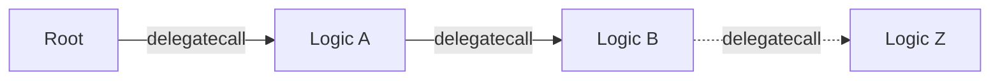

# Automation Contract Structure

The on-chain component of Chainlink automation is too large to fit into the [size requirements][size-limit-eip] of a single contract. Therefore, we include this explanation of how the pieces fit together and various tradeoffs incurred.

### Glossary

**Root Contract** - also known as the “storage” contract. This is the contract whose state we care about. It is the on-chain entry-point into the system. The root contract uses `delegatecall` to execute code at various logic contracts. (We avoid the term "proxy" because it is commonly associated with upgradability, and this system _is not upgradable_ even though it relies on some of the same mechanics.)

**Logic Contract** - this a contract whose sole purpose is to hold code. We use the code at this address and execute it in the context of the root contract in order to increase our total capacity for on-chain code.

### Overview

We chain multiple logic contracts together using [fallback functions][fallback] and [delegatecall][delegatecall]. If a function definition is not found on one contract, we fallback to the next, always executing the function in the scope of the root contract. The actual implementation of this is based off of [OZ's Proxy contract][oz-proxy].

### Diagram

### Special Considerations

- functions on the root contract have the least gas overhead. Therefore, our most price-sensitive functions live there. We have 3 functions that we consider hot paths. Ideally, these would all live on the root contract to minimize gas overhead.
  - `transmit()` - this is the most important code path
  - `registerUpkeep()`
  - `addFunds()` 
- functions on the root contract have first-class support from tools like etherscan and tenderly - functions that we (or users) call often to debug should live there
- etherscan supports executing logic contract functions that are once removed from the root - therefore we give secondary preference to the first logic contract for user and debugging functions
- functions on logic B through logic Z (as of writing) have no support on etherscan and will essentially be "invisible" to everyone but advanced users - we will try to reserve this space for uncommon interactions that are mostly done progamatically
- We use Logic A, B, C... to avoid confusion with the version ex `AutomationRegistryLogicA2_1.sol` --> Logic Contract A verion 2.1
- Storage locations for logic contract addresses MUST BE BYTECODE (this is done by marking them as "immutable") otherwise the chaining mechanism will break

### Master Interface

The Master Interface is a deduped combination of all the interfaces from all contracts in the chain. We generate this interface programatically using the script `generate-automation-master-interface.ts`.

[size-limit-eip]: https://eips.ethereum.org/EIPS/eip-170
[fallback]: https://docs.soliditylang.org/en/v0.8.12/contracts.html#fallback-function
[delegatecall]: https://docs.soliditylang.org/en/v0.8.12/introduction-to-smart-contracts.html?highlight=delegatecall#delegatecall-callcode-and-libraries
[oz-proxy]: https://docs.openzeppelin.com/contracts/4.x/api/proxy#Proxy