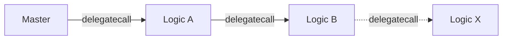

# Automation Contract Structure

The on-chain component of Chainlink automation is too large to fit into the [size requirements][size-limit-eip] of a single contract. It is also too large to fit into 2 contracts, a solution that works for most large projects. Therefore, we included this explanation of how the pieces fit together and various tradeoffs incurred.

### Glossary

**Master Contract** - also known as the “storage” contract. This is the contract whose state we care about. It is the entry-point into the chain of delegatecalls. (We avoid the term "proxy" because it is commonly associated with upgradability, and this system _is not upgradable_ even though it relies on some of the same mechanics.)

**Logic Contract** - this a contract whose sole purpose is to hold code. We use the code at this address and execute it in the context of the master contract in order to increase our total capacity for on-chain code.

### Overview

We chain multiple logic contracts together using [fallback functions][fallback] and [delegatecall][delegatecall]. If a function definition is not found on one contract, we fall back to the next, always executing the function in the scope of the master contract. The actual implementation of this is based off of [OZ's Proxy contract][oz-proxy].

### Diagram

### Special Considerations

- functions on the master contract have the least gas overhead, therefore, our most price-sensitive functions live there
- functions on the master contract have first-class support from tools like etherscan and tenderly - functions that we (or users) call often to debug should live there
- etherscan supports executing logic contract functions that are once removed from the master - therefore we give secondary preference to the first logic contract for user and debugging functions
- functions on logic A through logic X (as of writing) have no support on etherscan and will essentially be "invisible" to everyone but advanced users - we will try to reserve this space for uncommon interactions that are mostly done progamatically
- We use Logic A, B, C... to avoid confusion with the version ex `KeeperRegistryLogicA2_1.sol` --> Logic Contract A verion 2.1
- Storage locations for logic contract addresses MUST BE BYTECODE (this is done by marking them as "immutable") otherwise the chaining mechanism will break

### Master Interface

The Master Interface is a deduped combination of all the interfaces from all contracts in the chain. We generate this interface programatically using the script `generate-automation-master-interface.ts`. This process is not a hardened one. Users of this script should take great care to ensure it's efficacy.

### Future Improvements

- We could use this script to change `checkUpkeep` from an executable function to a "view" function in the master interface - this would make interacting with the contract simpler in tests and (maybe) also from the core node.

[size-limit-eip]: https://eips.ethereum.org/EIPS/eip-170
[fallback]: https://docs.soliditylang.org/en/v0.8.12/contracts.html#fallback-function
[delegatecall]: https://docs.soliditylang.org/en/v0.8.12/introduction-to-smart-contracts.html?highlight=delegatecall#delegatecall-callcode-and-libraries
[oz-proxy]: https://docs.openzeppelin.com/contracts/4.x/api/proxy#Proxy
