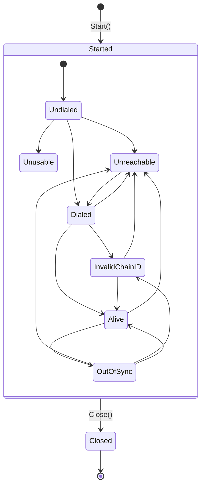

# EVM Client

## Node FSM

```mermaid
stateDiagram-v2
    [*] --> Started : Start()
    
    state Started {
        [*] --> Undialed
        Undialed --> Unusable
        Undialed --> Unreachable
        Undialed --> Dialed
        
        Unreachable --> Dialed 
        
        Dialed --> Unreachable
        Dialed --> InvalidChainID
        Dialed --> Alive
        
        InvalidChainID --> Unreachable
        InvalidChainID --> Alive
        
        Alive --> Unreachable
        Alive --> OutOfSync
        
        OutOfSync --> Unreachable
        OutOfSync --> InvalidChainID    
        OutOfSync --> Alive    
    }
    
    Started --> Closed : Close()
    Closed --> [*]
```
