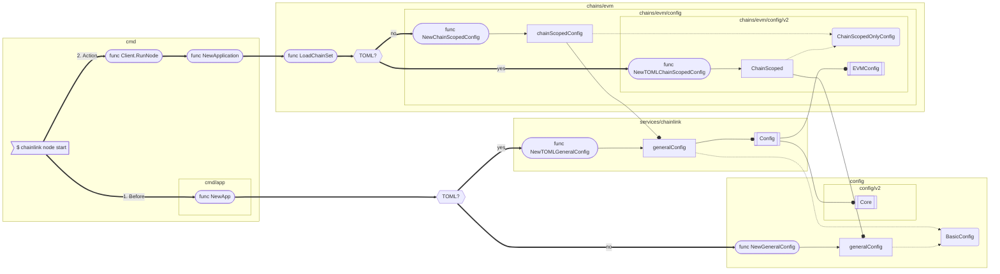

# Configuration Transition

- subgraph names are packages
- thick lines indicate control flow
- dotted lines indicate implicit interface implementation
- regular w/ dot indicate implementation types

