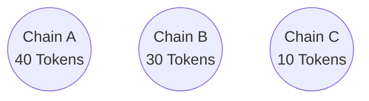
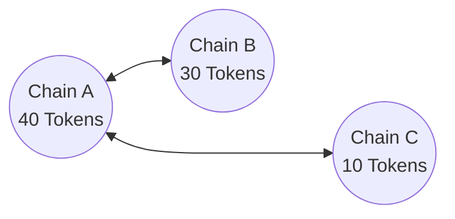
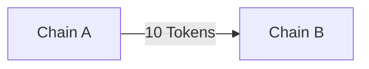
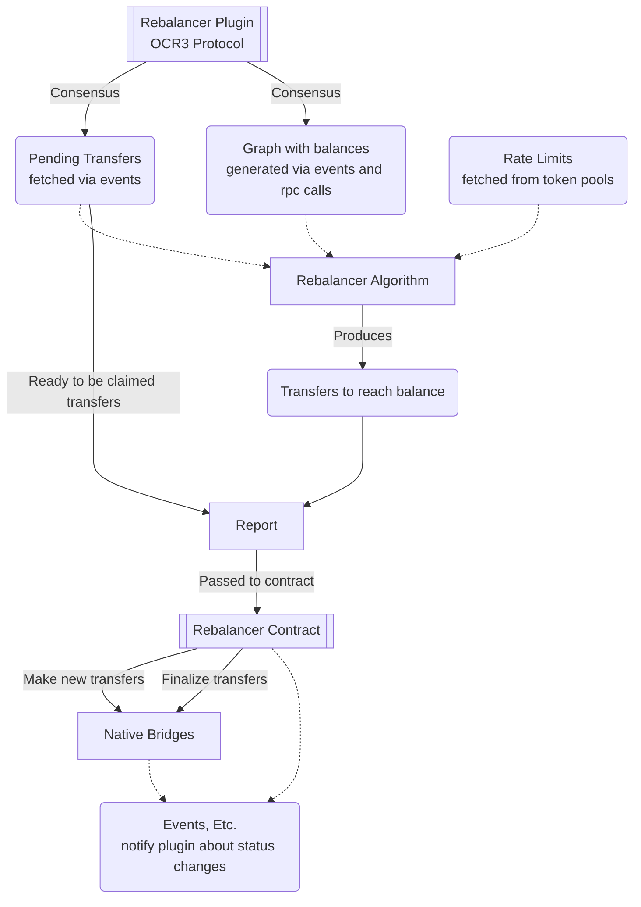
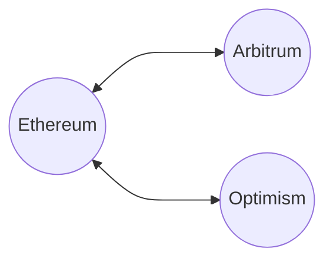

# Rebalancer

The rebalancer is an [OCR3](https://docs.chain.link/architecture-overview/off-chain-reporting) plugin responsible for rebalancing token liquidity across different chains.

## Dev Quickstart

About the code structure:
```
internal/   # contains tests
graph/      # graph related functionality
manager/    # client functionality for reading onchain data
rebalancer/ # rebalancing algorithm implementations
models/     # declarations of structs used across the plugin
ocr3impls/  # implementations of ocr3 specific interfaces (e.g. contract transmitter)
mocks/      # mock implementations of interfaces
factory.go  # ocr3 factory interface implementation
plugin.go   # ocr3 plugin interface implementation
```

Running the test suite:
```
go test ./...
```

Deploying the contracts and running the DON locally: 
```
To be added...
```

## What is the Rebalancer

Assume that we have the following token pools across 3 different chains. We already have some balance on each chain that was initially provided by the pool owners.



And now let's assume that we have a bridging protocol like [CCIP](https://chain.link/cross-chain) that operates across this 3 chains. The bridging protocol gives users the ability to transfer tokens across some of this chains.



When a user wants to transfer from one chain to another, the bridging protocol will lock the funds on the source chain and unlock them at the destination.

Imagine that we have the following transfer:



After this transfer is processed the token pool balances become:


We notice that the protocol locks the tokens of the user on the source chain and unlocks to transfer them on the destination chain. This means that in fact there is no actual "transfer" happening.

Imagine that this usage pattern remains and most users keep transferring tokens from `Chain A` to `Chain B`. The token pool on `Chain B` will eventually get empty, leading to failed transactions.

The rebalancer plugin comes to solve this.


## How it works

A [Rebalancer Contract](https://github.com/smartcontractkit/ccip/blob/85c5bf5a3b80cd0d84a825e5d052c90bf18c3337/contracts/src/v0.8/rebalancer/Rebalancer.sol#L24-L23) exists on each chain and is responsible for managing only a single token.

Let's see an overview of the config of this contract.

```go
// The token that this contract manages liquidity for.
localToken            address

// The chain selector (chain id) of this contract.
chainSelector         int

// The neighboring chain selectors. Chains that are destinations of this chain.
crossChainRebalancers chainSelector->address
```

And now let's see an overview of some functions of that contract.

```go
// Get the amount of tokens on this chain.
getLiquidity()

// Returns all the destination chains.
getAllCrossChainRebalancers()

// And several more that we will see later.
```

Let's assume that we are looking at the rebalancer contract on `Chain A` (our example above).

The `getAllCrossChainRebalancers()` will return something like this:

```json
{
    "ChainB_Selector": "ChainB_RebalancerContractAddress",
    "ChainC_Selector": "ChainC_RebalancerContractAddress"
}
```

Using this methods, when the rebalancer plugin boots or when there is a change, it discovers all the chain connections and the token balances on each chain.

It starts from a root chain that is defined on the plugin config, fetches the balance and the destination chains and then moves to the next chain, until all chains and balances are discovered ([BFS](https://en.wikipedia.org/wiki/Breadth-first_search)).

Eventually it generates a graph data structure similar to the ones we've seen above, that contains all the information we need.

> Apart from loading the graph and its data it also loads the pending transfers and the token pools rate limits, we'll talk about them in a while.

----

The OCR3 protocol is a decentralized protocol, meaning that multiple nodes are running the same instance of the rebalancer and each one of them should have generated their own graph instance.

Very briefly the protocol consists of the following phases:

```go
// An observation is made by the node.
Observation()

// Given a list of observations that were made by multiple nodes
// it generates the outcome that is agreed among the majority of them.
Outcome(observations) outcome

// Generates a list of reports that the contracts will receive.
Reports(outcome) report

//  Please read the OCR3 spec for more information and for reading about the other phases that are not listed here.
```

During the `Observation` phase the plugin will first find and apply any changes in the graph that was originally generated on boot.

Then it will find all the pending transfers and update the statuses of the existing ones.

And will send an observation that looks like this:

```json
"balances": {
    "chainA_selector": 50,
    "chainB_selector": 20,
    "chainC_selector": 10,
}

"transfers": [
    "[executed] transfer from chain A to chain B 10 tokens"
    "[pending] transfer from chain A to chain C 1 token",
    "..."
]
```

---

During the `Outcome` phase the plugin will receive all those observations made by the nodes and will generate a report that consists of:

1. Median Balance per chain - Each node has probably seen a different balance depending on the time the query was made, we take the median across all the values.

2. Pending Transfers - We keep the pending transfers that have been seen by at least `f + 1` nodes, where `f` is defined in the plugin config.

It looks similar to the observation but contains data that all nodes agreed on.

---

Finally during the `Reports` phase, based on the agreed balances and pending transfers the transfers that need to be made for reaching balance are calculated. This transfers are calculated according to an algorithm that is specified in the plugin's jobspec, we call it *the rebalancing algorithm*.

The transfers are grouped by chain and eventually one report per chain is generated and transmitted using a multichain ocr3 transmitter implementation.

---

Finally the reports are transmitted on-chain, and are picked up by the Rebalancer contract.

The data that the contract receives look like this:

```json
"newTransfers": [
    "send 10 tokens from A to B",
    "send 1 token from A to C"
]

"readyToClaim": [
    "5 tokens that B has sent are ready to be claimed"
]
```

The Rebalancer contract loops through all the *new transfers* that need to be made to reach balance and calls the native bridge on each chain to move the tokens according to the transfer details.

The native bridge will move the tokens and it's usually part of the blockchain protocol itself. Usually L1->L2 transfers are instant but L2->L1 takes one week.

After the Rebalancer calls the native bridge to transfer the tokens the transfer goes into the pending state until it gets executed.

Some bridges are simply transferring the tokens to the recipient, this means that after the Rebalancer contract calls the native bridge the tokens will go directly to the destination chain pool.

But there are also some bridges that require a transaction to be made in order to release those tokens. This requires the rebalancer plugin to keep checking for transfers that are ready to be claimed.

When a transfer is ready to be claimed it is included in the report sent to the rebalancer contract, that's the *readyToClaim* field we've seen above. Then the rebalancer contract calls the native bridge's specific function to complete the transfer.


The steps above are briefly displayed in the following diagram.



## Supported native bridges

The support of the bridges is work in progress.



Ethereum to Optimism and vice-versa:
https://docs.optimism.io/builders/dapp-developers/bridging/standard-bridge

Ethereum to Arbitrum and vice-versa:
https://docs.arbitrum.io/for-devs/concepts/token-bridge/token-bridge-overview
