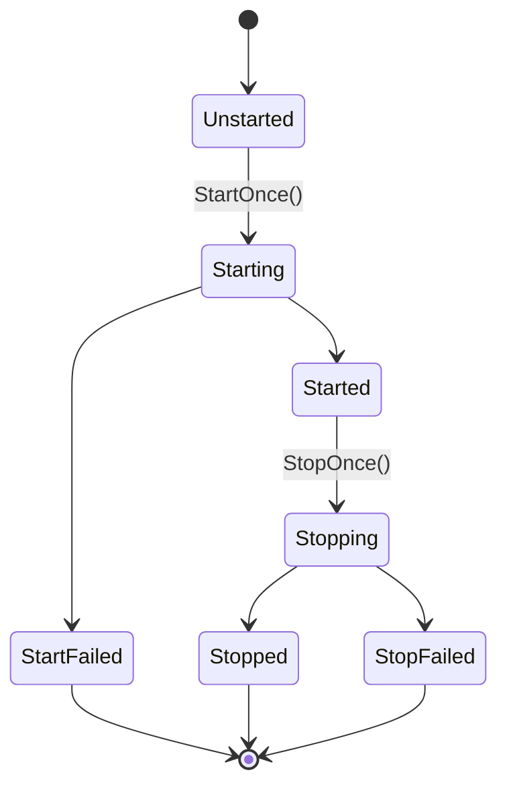

# `package utils`

## `StartStopOnce`

```mermaid
stateDiagram-v2
    [*] --> Unstarted
    Unstarted --> Starting : StartOnce()
    Starting --> StartFailed
    Starting --> Started
    Started --> Stopping : StopOnce()
    Stopping --> Stopped
    Stopping --> StopFailed
    StartFailed --> [*]
    Stopped --> [*]
    StopFailed --> [*]
```