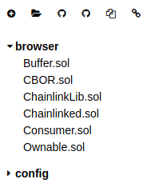
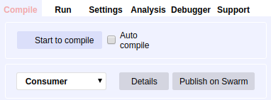
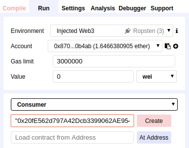

# Advanced Contract Deployment

This section of the guide uses [Remix](https://remix.ethereum.org) in order to compile and deploy the contract.

- In Remix, import the contracts at `chainlink/examples/ropsten/contracts`
- Click on the `Consumer.sol` contract in the left side-bar

- On the Compile tab, click on the "Start to compile" button near the top-right

- Change to the Run tab
- Select Consumer from the dropdown in the right panel
- Copy and paste the line below and enter it into the text field next to the Create button  
    <mark>"0x20fE562d797A42Dcb3399062AE9546cd06f63280", "0x5be84B6381d45579Ed04A887B8473F76699E0389", "d41a0bdf968a43aca8822cf81a2c1fa7"</mark>
- Click Create

- Metamask will prompt you to Confirm the Transaction
- You will need to choose a Gas Price (use 20 if you don't know what to pick)
- Select Submit

- A link to Etherscan will display at the bottom, you can open that in a new tab to keep track of the transaction

- Once successful, you should have a new address for the Consumer contract

You can now go back to [sending Ropsten LINK to the Consumer contract](./README.md#send-ropsten-link-to-the-consumer-contract).