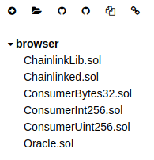
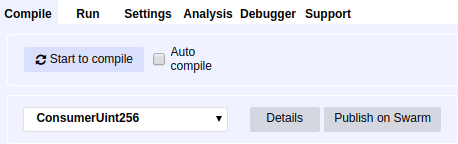
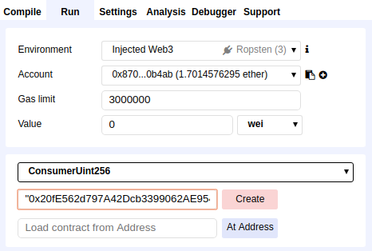
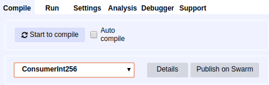
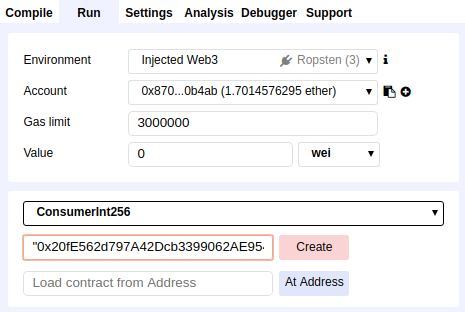
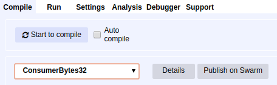
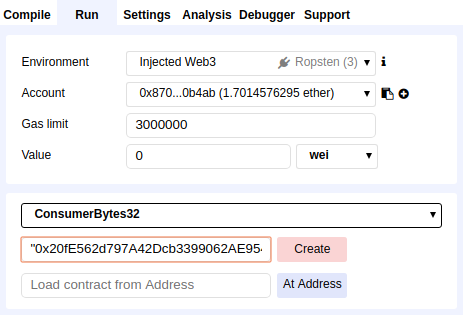
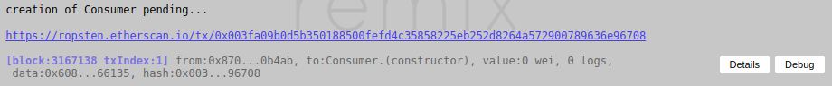

# Advanced Contract Deployment

This section of the guide uses [Remix](https://remix.ethereum.org) in order to compile and deploy contracts in the `examples/ropsten/contracts` directory.

In Remix, import the contracts at `chainlink/examples/ropsten/contracts`

You can now skip to the following sections:

- [ConsumerUint256 contract](#consumeruint256-contract)
- [ConsumerInt256 contract](#consumerint256-contract)
- [ConsumerBytes32 contract](#consumerbytes32-contract)

## ConsumerUint256 Contract

- Click on the `ConsumerUint256.sol` contract in the left side-bar
- On the Compile tab, click on the "Start to compile" button near the top-right

- Change to the Run tab
- Select ConsumerUint256 from the dropdown in the right panel
- Copy and paste the line below and enter it into the text field next to the Create button  
    **"0x20fE562d797A42Dcb3399062AE9546cd06f63280", "0x5be84B6381d45579Ed04A887B8473F76699E0389", "d41a0bdf968a43aca8822cf81a2c1fa7"**
- Click Create

Go to [Remix to Metamask Contract Deployment](#remix-to-metamask-contract-deployment)

## ConsumerInt256 contract

- Click on the `ConsumerInt256.sol` contract in the left side-bar
- On the Compile tab, click on the "Start to compile" button near the top-right

- Change to the Run tab
- Select ConsumerInt256 from the dropdown in the right panel
- Copy and paste the line below and enter it into the text field next to the Create button  
    **"0x20fE562d797A42Dcb3399062AE9546cd06f63280", "0x5be84B6381d45579Ed04A887B8473F76699E0389", "5eadba6f077e4ca8ac88cc370eb66a5f"**
- Click Create

Go to [Remix to Metamask Contract Deployment](#remix-to-metamask-contract-deployment)

## ConsumerBytes32 contract

- Click on the `ConsumerBytes32.sol` contract in the left side-bar
- On the Compile tab, click on the "Start to compile" button near the top-right

- Change to the Run tab
- Select ConsumerBytes32 from the dropdown in the right panel
- Copy and paste the line below and enter it into the text field next to the Create button  
    **"0x20fE562d797A42Dcb3399062AE9546cd06f63280", "0x5be84B6381d45579Ed04A887B8473F76699E0389", "2660763707434f35bb58a9db33ee1803"**
- Click Create

Go to [Remix to Metamask Contract Deployment](#remix-to-metamask-contract-deployment)

## Remix to Metamask Contract Deployment

- Metamask will prompt you to Confirm the Transaction
- You will need to choose a Gas Price (use 20 if you don't know what to pick)
- Select Submit

- A link to Etherscan will display at the bottom, you can open that in a new tab to keep track of the transaction

- Once successful, you should have a new address for the deployed contract

You can now go back to [sending Ropsten LINK to the Consumer contract](./README.md#send-ropsten-link-to-the-consumer-contract).