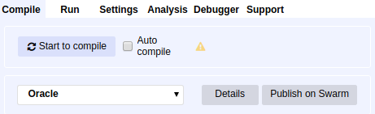
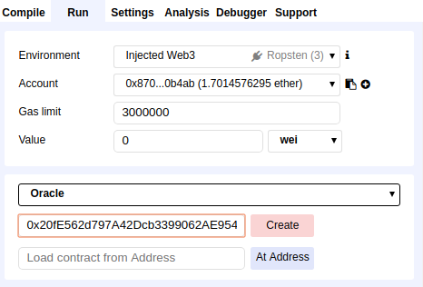
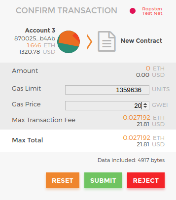
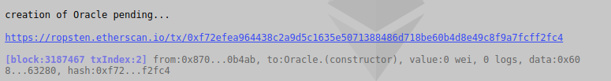
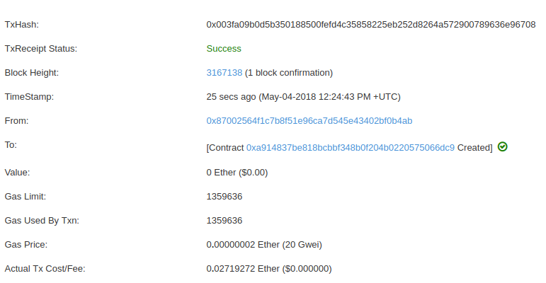
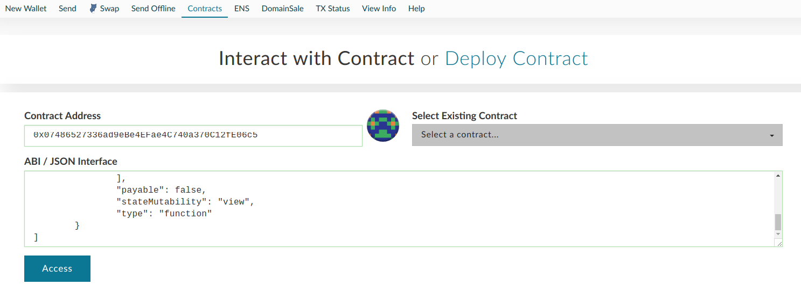
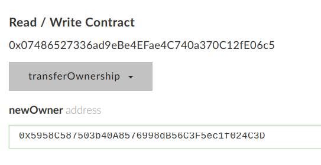
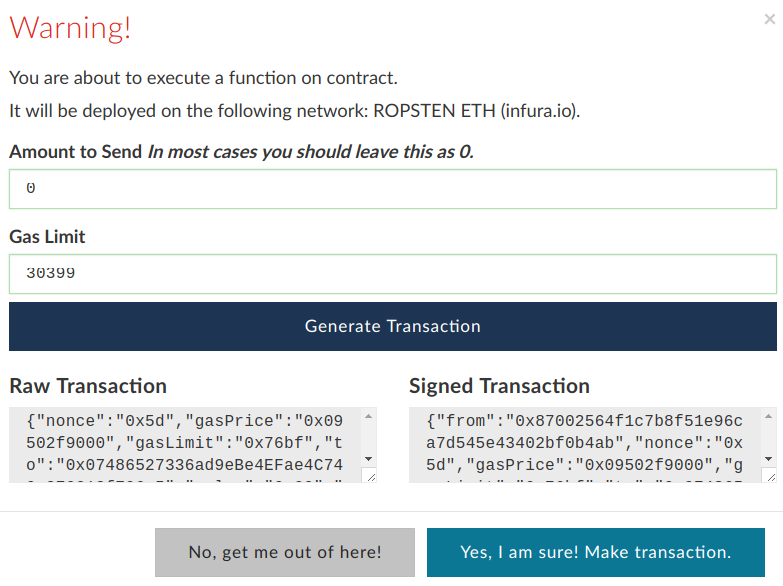
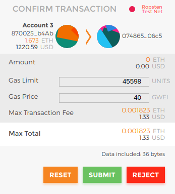

## Oracle contract

Before deploying your own Oracle contract, make sure you have gone through the instructions to set up your [Chainlink node on Ropsten](./RopstenNode.md).

- In Remix, import the contracts at `chainlink/examples/ropsten/contracts`
- Click on the `Oracle.sol` contract in the left side-bar
- On the Compile tab, click on the "Start to compile" button near the top-right



- Change to the Run tab
- Select Oracle from the dropdown in the right panel
- Copy and paste the line below and enter it into the text field next to the Create button <br>
    **0x20fE562d797A42Dcb3399062AE9546cd06f63280**
- Click Create



- Metamask will prompt you to Confirm the Transaction
- You will need to choose a Gas Price (use 20 if you don't know what to pick)
- Select Submit



- A link to Etherscan will display at the bottom, you can open that in a new tab to keep track of the transaction



- Once successful, you should have a new address for the deployed contract



- Keep note of the Oracle contract's address, you will need it for adding a JobSpec to the node.

- In MyCrypto/Mew, go to the Contracts tab
- Paste the deployed Oracle contract address and the [OracleABI](./OracleABI.json), and click Access



- Select the `transferOwnership` method and paste in the address of your Chainlink node

You can get the address of your node when you start it with `chainlink node`. There will be an `[INFO]` line displayed similar to the one below:

```
2018-05-07T16:01:24Z [INFO]  ETH Balance for 0x5958C587503b40A8576998dB56C3F5ec1f024C3D: 1.962567814000000000 cmd/client.go:71 
```



- Access your wallet with MetaMask and click Write
- Generate the transaction



- Submit with MetaMask



Keep note of your Oracle contract's address, you can now use this address for any of the [Advanced Deployment](./AdvancedDeploy.md) instructions.