# Chainlink Ropsten Instructions

This guide will allow you to create and deploy a consuming contract to fulfill a data request using our deployed oracle contract. You do not need to run a node yourself in order to follow these instructions.

## Additional Guides

- [Running your own Chainlink node on Ropsten](./RopstenNode.md)

## Tools

This guide requires the following tools:

- [Metamask](https://metamask.io/)
- [Remix](http://remix.ethereum.org)

## General Overview

Interacting with contracts that require data from Chainlink follow a common workflow:

- Deploy a requesting contract
- Fund the requesting contract with LINK
- Call the function within the requesting contract to create a Chainlink run
  - This transfers LINK from the requesting contract to the oracle contract
- Retrieve the value from the consuming contract

The examples included here have the requesting and consuming contracts as the same contract. If you wanted the answer to be supplied to a different contract, you would change the word `this` and the function signature in the line below to that of the consuming contract:

```
ChainlinkLib.Run memory run = newRun(PRICE_SPEC_ID, this, "fulfillEthereumPrice(bytes32,uint256)");
```

## Setup

It is recommended to use the Beta version of Metamask for this guide. Accessing the beta can be accomplished by clicking on the (☰) icon, then "Try Beta!" The interface should reload, and you will see the new look.

Add the Ropsten LINK token to Metamask:

- Switch to the "Ropsten Test Net" network in Metamask
- Click on the (☰) icon
- Click Add Token button
- Click the Custom Token tab
- Paste the contract address 0x20fE562d797A42Dcb3399062AE9546cd06f63280
- The rest should fill in, if it doesn't the Token Symbol is LINK and use 18 for Decimals

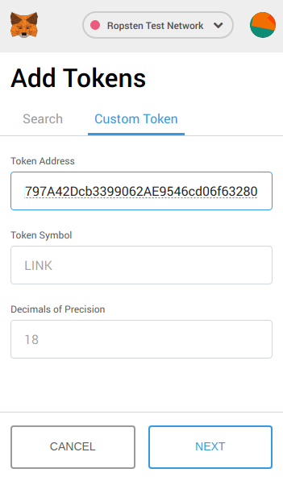

- Click Next

You should now see LINK listed on the Ropsten Test Network, finish by clicking the last "Add Tokens" button.


### Faucets

With your Metamask wallet set up, you'll need some Ropsten ETH and LINK to work with.

Ropsten ETH
- http://faucet.ropsten.be:3001/
- https://faucet.metamask.io/

Ropsten LINK
- https://developers.smartcontract.com/faucet

## Contract Deployment

This section of the guide uses [Remix](https://remix.ethereum.org) in order to compile and deploy an example contract from the `examples/ropsten/contracts` directory.

In Remix, import the `RopstenConsumer.sol` contract at `chainlink/examples/ropsten/contracts`

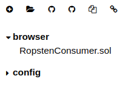

- Click on the `RopstenConsumer.sol` contract in the left side-bar
- On the Compile tab, click on the "Start to compile" button near the top-right

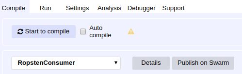

- Change to the Run tab
- RopstenConsumer should already be selected
- Click Deploy

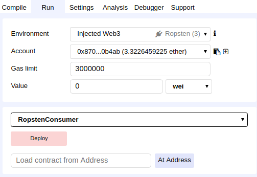

- Metamask will prompt you to Confirm the Transaction
- You will need to choose a Gas Price (use 20 if you don't know what to pick)
- Select Submit

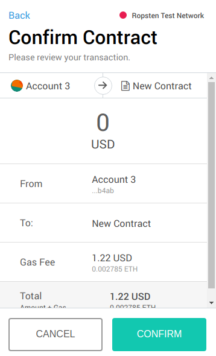

- A link to Etherscan will display at the bottom, you can open that in a new tab to keep track of the transaction

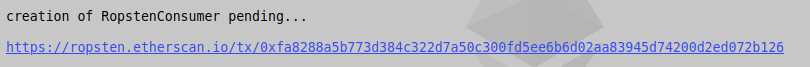

- Once successful, you should have a new address for the deployed contract


### Funding the contract

With the contract deployed, you will need to send some Ropsten LINK to it in order to create a request.

- Click the icon with the red box around it in the Remix interface to copy the address.

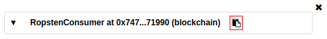

- Then in Metamask, click the (☰) icon, then the LINK token
- Click the Send button
- Paste the address into the "To:" line

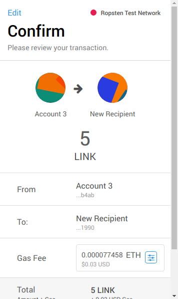

Metamask will update the status to confirmed when the transaction is complete.

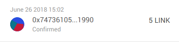

### Calling the contract

In Remix, you can interact with and call the requesting functions directly, by supplying a string for the methods that begin with "request".

- Type "USD" in the `requestEthereumPrice` text input, and click on its button.

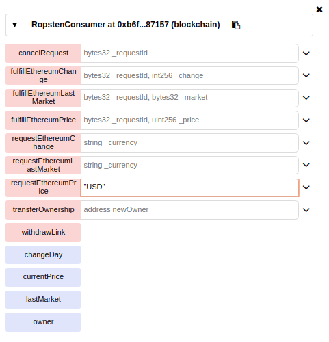

- Scroll down if required and click the Confirm button

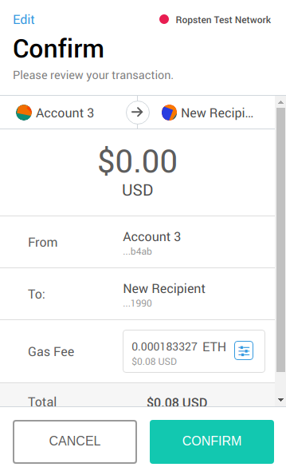

- And after a few blocks, the updated value retrieved by Chainlink will be visible for each of the `requestEthereum*` methods that were requested

