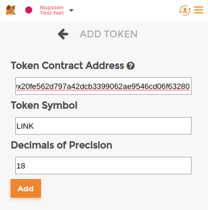
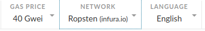
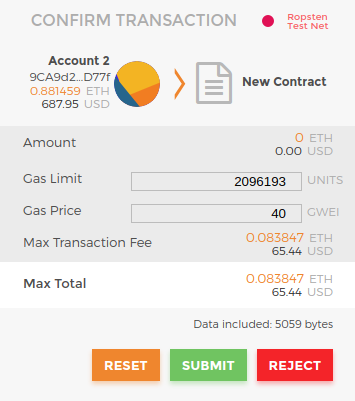
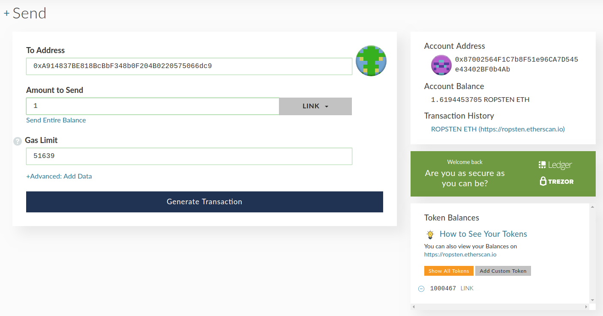
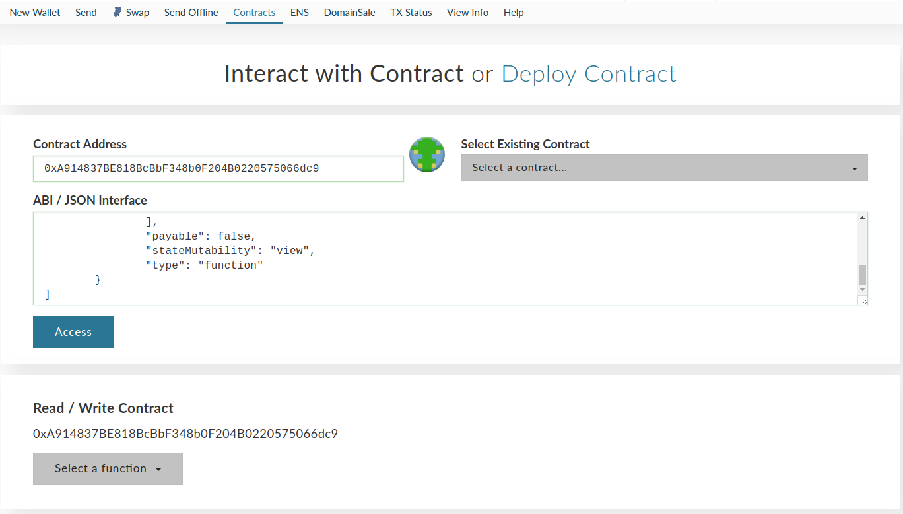
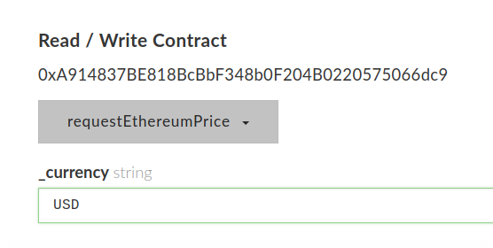
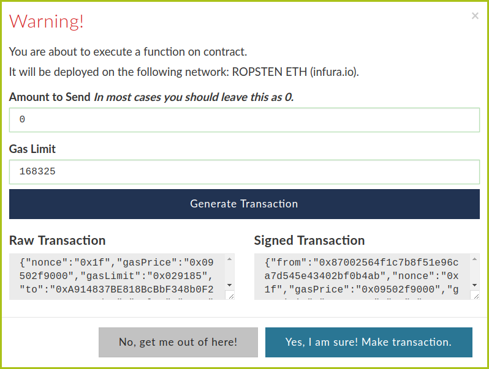
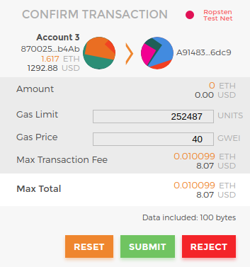
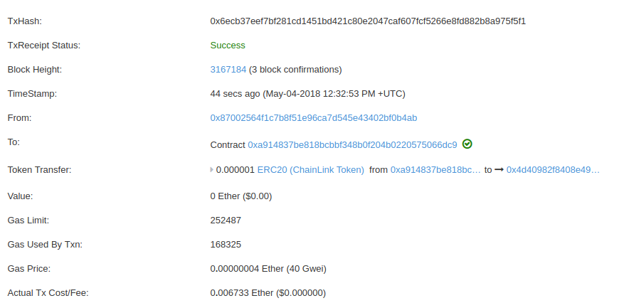
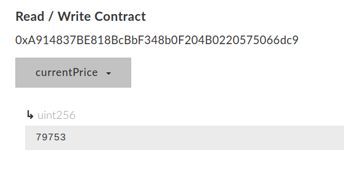

# Chainlink Ropsten Instructions

This guide will allow you to create and deploy a consuming contract to fulfill a data request using our deployed oracle contract. You do not need to run a node yourself in order to follow these instructions.

## Additional Guides

- [Running your own Chainlink node on Ropsten](./RopstenNode.md)
- [Deploying your own oracle contract](./OracleContract)
- [Example with `int256` data](./AdvancedDeploy.md#consumerint256-contract)
- [Example with `bytes32` data](./AdvancedDeploy.md#consumerbytes32-contract)

## Tools

This guide requires the following tools:

- [Metamask](https://metamask.io/)
- [MyCrypto](https://mycrypto.com) or [MyEtherWallet](https://www.myetherwallet.com/)

## General Overview

Interacting with contracts that require data from Chainlink follow a common workflow:

- Deploy a requesting contract
- Fund the requesting contract with LINK
- Call the function within the requesting contract to create a Chainlink run
  - This transfers LINK from the requesting contract to the oracle contract
- Retrieve the value from the consuming contract

The examples included here have the requesting and consuming contracts as the same contract. If you wanted the answer to be supplied to a different contract, you would change the word `this` and the function signature in the line below to that of the consuming contract:

```
ChainlinkLib.Run memory run = newRun(jobId, this, "fulfill(bytes32,bytes32)");
```

## Setup

Add the Ropsten LINK token to Metamask:

- Switch to the "Ropsten Test Net" network in Metamask
- Click on the Tokens tab
- Click Add Token button
- Paste the contract address 0x20fE562d797A42Dcb3399062AE9546cd06f63280
- The rest should fill in, if it doesn't the Token Symbol is LINK and use 18 for Decimals



You should now see your Ropsten LINK

### Faucets

Ropsten ETH
- http://faucet.ropsten.be:3001/
- https://faucet.metamask.io/

Ropsten LINK
- Let the team know your Ropsten Ethereum address on [Gitter](https://gitter.im/smartcontractkit-chainlink/Lobby) and Ropsten LINK will be sent to you.

## Publish the Consuming Contract

- Update your local repository from [Chainlink](https://github.com/smartcontractkit/chainlink) or [download](https://github.com/smartcontractkit/chainlink/archive/master.zip) a zip.

Optionally, you can skip to the [Advanced](./AdvancedDeploy.md#consumeruint256-contract) instructions to view the contract source code in Remix.

- In MyEtherWallet or MyCrypto, change the Network to Ropsten



- Navgate to the Contracts tab
- Click on Deploy Contract
- Paste the value in the [ConsumerByteCode](./ConsumerByteCode) file into the Byte Code field
- The Gas Limit should auto-fill for you, if it doesn't, enter 2000000


- Access your wallet with MetaMask
- Sign Transaction
- Deploy Contract
- Submit in Metamask



## Send Ropsten LINK to the Consumer Contract

Now that your Consumer contract is deployed to Ropsten, you need to send some Ropsten LINK to it.

- Open your favorite wallet (MEW, MyCrypto, etc.) and connect to the Ropsten network


- Go to the Send tab in MEW or MyCrypto
- Access your wallet using Metamask
- You may need to add the Ropsten LINK token to the wallet so that it recognizes it
  - Contract address: 0x20fE562d797A42Dcb3399062AE9546cd06f63280
  - Token Symbol: LINK
  - Decimals: 18
- Send LINK to the deployed address of your Consumer contract (1 LINK is enough for 1 request using this example)



## Call the Consumer Contract to Request Data from Chainlink

The Consumer contract should now have some Ropsten LINK on it. Now you can call it to make a request on the network. The examples below use functionallity from MyEtherWallet & MyCrypto.

- Go to the Contracts tab
- Paste your deployed Consumer contract address
- You can get the API / JSON Interface from the [`ConsumerABI.json`](./ConsumerABI.json) file
- Paste the ABI and click the Access button
- A new section appears labeled Read / Write Contract



- Click the Select a function drop-down and choose `requestEthereumPrice`
- The values accepted for the `_currency` field are `USD`, `EUR`, and `JPY`.



- Access your wallet using Metamask again, and send the transaction leaving the Amount to Send as 0, and Gas Limit as the default.





- Follow the link to Etherscan and wait until the transaction successfully completes



## Verify Data was Written

Back on the Contracts tab of MyEtherWallet or MyCrypto:

- Enter your Consumer contract address and the ABI from Remix
- Select the `currentPrice` function
- The newly-written value should be displayed



Congratulations! Your contract just received information from the internet using Chainlink!

If you found an issue with this example, please feel free to submit a pull request with a fix! We value contributions of all sizes!