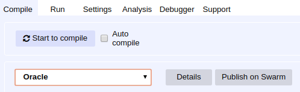
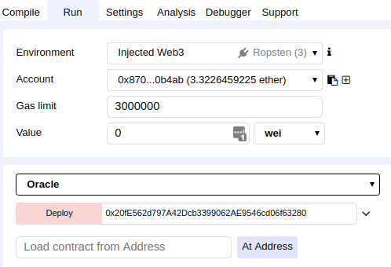
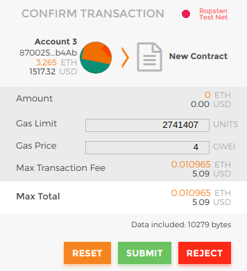
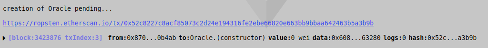

# Running your own Chainlink node on Ropsten

## Syncing a Ropsten Ethereum Node

### [DevNet](https://github.com/smartcontractkit/devnet)

- Clone the ropository

```bash
git clone https://github.com/smartcontractkit/devnet.git
```

- Enter into the directory

```bash
cd devnet
```

- Run the command to invoke DevNet on Ropsten

```bash
$ make ropsten
```

### [Geth](https://github.com/ethereum/go-ethereum)

```
$ geth --testnet --ws --wsaddr 127.0.0.1 --wsport 18546 --wsorigins "*"
```

### [Parity](https://github.com/paritytech/parity)

```
$ parity --chain=ropsten --ws-interface 127.0.0.1 --ws-port 18546 --ws-origins "all"
```

## Environment Variables

Use the following environment variables as an example to configure your node for Ropsten:

    LOG_LEVEL=debug
    ROOT=~/.ropsten
    ETH_URL="ws://localhost:18546"
    ETH_CHAIN_ID=3
    TX_MIN_CONFIRMATIONS=2
    TASK_MIN_CONFIRMATIONS=2
    USERNAME=chainlink
    PASSWORD=twochains
    LINK_CONTRACT_ADDRESS=0x20fe562d797a42dcb3399062ae9546cd06f63280
    MINIMUM_CONTRACT_PAYMENT=1000000000000

## Running the Node

Once environment variables are set, run the node with:

```bash
$ chainlink node
```

*You can also [run the node with Docker](https://github.com/smartcontractkit/chainlink/wiki/Running-the-Docker-Image).*

When running the node for the first time, it will ask for a password and confirmation password. It will use this password to create a keystore file for you at `$ROOT/keys`. It will then display the following, showing you the address and its current balance:

```
2018-05-07T17:20:50Z [WARN]  0 Balance. Chainlink node not fully functional, please deposit ETH into your address: 0xC9EED6F5018E6aB95c03FcDfe661e38e97018235 cmd/client.go:70        
2018-05-07T17:20:50Z [INFO]  ETH Balance for 0xC9EED6F5018E6aB95c03FcDfe661e38e97018235: 0.000000000000000000 cmd/client.go:71        
2018-05-07T17:20:50Z [INFO]  Link Balance for 0xC9EED6F5018E6aB95c03FcDfe661e38e97018235: 0.000000000000000000 cmd/client.go:74
```

## Getting Ropsten ETH

Visit the faucet [here](http://faucet.ropsten.be:3001/) and paste your node's address to receive Ropsten ETH.

## Deploying your own Oracle contract

- In Remix, import the contracts at `chainlink/solidity/contracts`
- Click on the `Oracle.sol` contract in the left side-bar
- You may need to update the import paths since Remix doesn't support folders
  - You can also use a tool like [truffle-flattener](https://www.npmjs.com/package/truffle-flattener) to simplify this process
- On the Compile tab, click on the "Start to compile" button near the top-right



- Change to the Run tab
- Select Oracle from the dropdown in the right panel
- Copy and paste the line below and enter it into the text field next to the Deploy button <br>
    **0x20fE562d797A42Dcb3399062AE9546cd06f63280**
- Click Deploy



- Metamask will prompt you to Confirm the Transaction
- You will need to choose a Gas Price (use 20 if you don't know what to pick)
- Select Submit



- A link to Etherscan will display at the bottom, you can open that in a new tab to keep track of the transaction



- Once successful, you should have a new address for the deployed contract


- Keep note of the Oracle contract's address, you will need it for adding a JobSpec to the node.

- Last, in Remix, call the `transferOwnership` function with the address of your node as the input parameter.

## Running and Adding Jobs

With your own Oracle contract, you can run your own node to fulfill jobs. With the `RopstenConsumer.sol` example contract, you would simply change the `ROPSTEN_ORACLE_ADDRESS` value to your deployed oracle contract address.

If you would like to run requests based on a pre-defined spec, we have example [JobSpecs](https://github.com/smartcontractkit/chainlink/wiki/Job-Pipeline) in the `jobs/` directory. Adding jobs can be done by using the command `chainlink c` with the path to the JobSpec file.

**You will need to modify each JobSpec to update the `"address"` for the `RunLog` initiator to your deployed oracle contract address.**

EthUint256:

```
$ chainlink c jobs/EthUint256Job.json
```

EthUint256 with the value multiplied by 100:

```
$ chainlink c jobs/EthUint256Jobx100.json
```

EthInt256

```
$ chainlink c jobs/EthInt256Job.json
```

EthBytes32

```
$ chainlink c jobs/EthBytes32.json
```