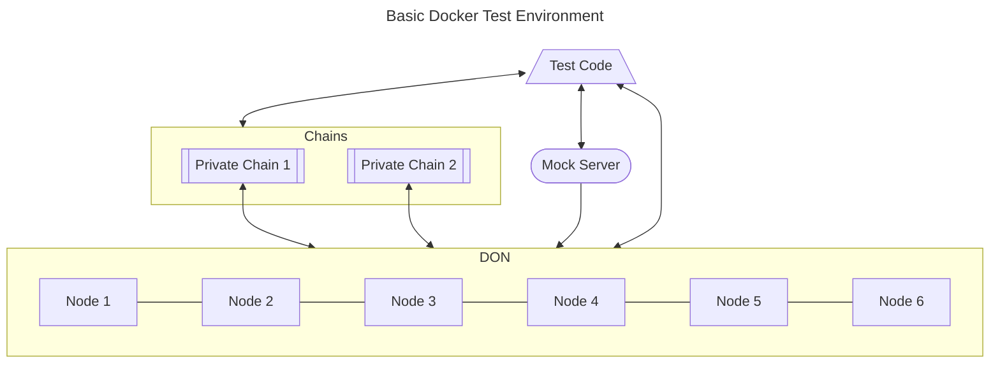

# CCIP Tests

Here lives the integration tests for ccip, utilizing our [chainlink-testing-framework](https://github.com/smartcontractkit/chainlink-testing-framework) and [integration-tests](https://github.com/smartcontractkit/ccip/tree/ccip-develop/integration-tests)

## Setup the Tests

CCIP tests are designed to be highly configurable. Instead of writing many tests to check specific scenarios, the philosophy is to write a few unique tests and make them adjustable through the use of test inputs and configurations. There are a few different ways to set this configuration:

1. Default test input - set via TOML - If no specific input is set; the tests will run with default inputs mentioned in [default.toml](./testconfig/tomls/ccip-default.toml).
Please refer to the [testconfig README](../testconfig/README.md) for a more detailed look at how testconfig works.
2. If you want to run your test with a different config, you can override the default inputs. You can either write an [overrides.toml](../testconfig/README.md#configuration-and-overrides) file, or set the env var `BASE64_CCIP_CONFIG_OVERRIDE` containing the base64 encoded TOML file content with updated test input parameters.
For example, if you want to override the `Network` input in test and want to run your test on `avalanche testnet` and `arbitrum goerli` network, you need to:
   1. Create a TOML file with the following content:

        ```toml
      [CCIP]
      [CCIP.Env]
      [CCIP.Env.Network]
      selected_networks= ['AVALANCHE_FUJI', 'ARBITRUM_GOERLI']
        ```

   2. Encode it using the `base64` command
   3. Set the env var `BASE64_CCIP_CONFIG_OVERRIDE` with the encoded content.

        ```bash
        export BASE64_CCIP_CONFIG_OVERRIDE=$(base64 -i <path-to-override-toml-file>)
        ```

        [mainnet.toml](./testconfig/override/mainnet.toml), [override.toml](./testconfig/examples/override.toml.example) are some of the sample override TOML files.

        For example - In order to run the smoke test (TestSmokeCCIPForBidirectionalLane) on mainnet, run the test with following env var set:

        ```bash
        export BASE64_CCIP_CONFIG_OVERRIDE=$(base64 -i ./testconfig/override/mainnet.toml)
        ```

3. Secrets - You also need to set some secrets. This is a mandatory step needed to run the tests. Please refer to [sample-secrets.toml](./testconfig/examples/secrets.toml.example) for the list of secrets that are mandatory to run the tests.
   - The chainlink image and tag are required secrets for all the tests.
   - If you are running tests in live networks like testnet and mainnet, you need to set the secrets (rpc urls and private keys) for the respective networks.
   - If you are running tests in simulated networks no network specific secrets are required.
   here is a sample secrets.toml file, for running the tests in simulated networks, with the chainlink image and tag set as secrets:

   ```toml
   [CCIP]
   [CCIP.Env]
   # ChainlinkImage is mandatory for all tests.
   [CCIP.Env.NewCLCluster]
   [CCIP.Env.NewCLCluster.Common]
   [CCIP.Env.NewCLCluster.Common.ChainlinkImage]
   image = "chainlink-ccip"
   version = "latest"
   ```

   We consider secrets similar to test input overrides and encode them using `base64` command.
   Once you have the secrets.toml file, you can encode it using `base64` command (similar to step 2) and set the env var `BASE64_CCIP_SECRETS_CONFIG` with the encoded content.

    ```bash
        export BASE64_CCIP_SECRETS_CONFIG=$(base64 -i ./testconfig/tomls/secrets.toml)
    ```

**Please note that the secrets should NOT be checked in to the repo and should be kept locally.**

We recommend against changing the content of [sample-secrets.toml](./testconfig/examples/secrets.toml.example). Please create a new file and set it as the secrets file.
You can run the command to ignore the changes to the file.

```bash
git update-index --skip-worktree <path-to-secrets-file>
```

## Running the Tests

There are two ways to run the tests:

1. Using local docker containers
2. Using a remote kubernetes cluster

### Using Local Docker Containers

In order to run the tests locally, you need to have docker installed and running on your machine.
You can use a specific chainlink image and tag (if you already have one) for the tests. Otherwise, you can build the image using the following command:

```bash
make build_ccip_image image=chainlink-ccip tag=latest-dev # please choose the image and tag name as per your choice
```

For a local run, tests creates two private geth networks and runs the tests on them. Running tests on testnet and mainnet is not supported yet for local docker tests and must be run in a kubernetes environment.

1. [Setting the test inputs](#setup-the-tests)
    1. If required, create an `override.toml` with the required test inputs. If you want to run the tests with default parameters, you can skip this step.
    2. Create a TOML file with the secrets.
2. Run the following command to run the smoke tests with your custom override toml and secrets.

```bash
# mark the testimage as empty for running the tests in local docker containers
make test_smoke_ccip testimage="" testname=TestSmokeCCIPForBidirectionalLane override_toml="<the toml file with overridden config string>" secret_toml="<the toml file with secrets string>"
```

If you don't want to bother with any overrides, you can run with the default TOML settings with the below command.

```bash
make test_smoke_ccip_default testname=TestSmokeCCIPForBidirectionalLane secret_toml="<the toml file with secrets string>"
```



### Using Remote Kubernetes Cluster

For running more complex and intensive tests (like load and chaos tests) you need to connect the test to a Kubernetes cluster. These tests have more complex setup and running instructions. We endeavor to make these easier to run and configure, but for the time being please seek a member of the QA/Test Tooling team if you want to run these.
