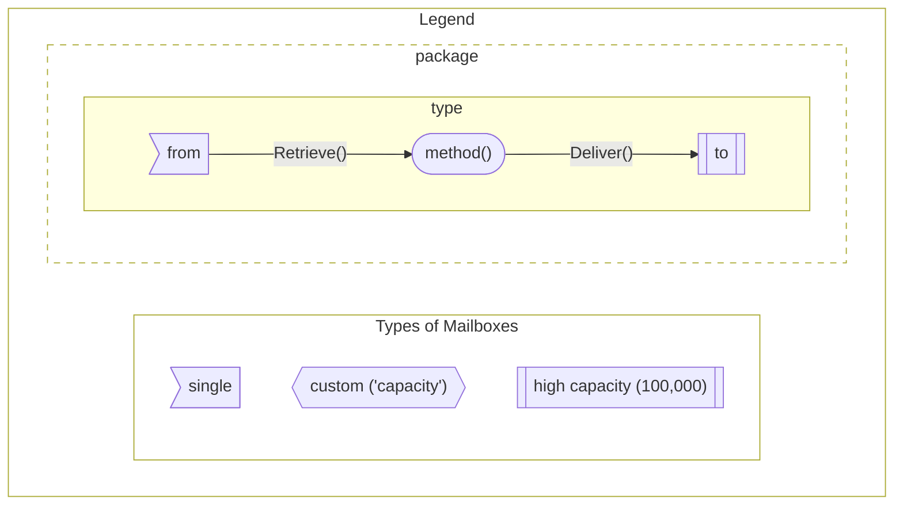

# Mailboxes

```mermaid
flowchart
    subgraph Legend
        style Legend fill:none 
        subgraph mailboxes [Types of Mailboxes]
            style mailboxes fill:none 
            single>single]
            custom{{"custom ('capacity')"}}
            high[["high capacity (100,000)"]]
        end
        subgraph package
            style package fill:none,stroke-dasharray: 6
            subgraph type   
                direction LR
                from>from] -- "Retrieve()" --> method(["method()"]) -- "Deliver()" --> to[[to]]
            end
        end
    end
```

```mermaid
flowchart TB
    subgraph core/chains/evm
        subgraph gas
            subgraph BlockHistoryEstimator [BlockHistoryEstimator]
                direction TB
                BlockHistoryEstimator-mb>mb]
                BlockHistoryEstimator-OnNewLongestChain(["OnNewLongestChain()"]) -- "Deliver()" --> BlockHistoryEstimator-mb 
                BlockHistoryEstimator-runLoop["runLoop()"]  
                BlockHistoryEstimator-mb -- "Notify()" --> BlockHistoryEstimator-runLoop  
                BlockHistoryEstimator-mb -- "Retrieve()" --> BlockHistoryEstimator-runLoop  
            end
        end
        subgraph headtracker-pkg [headtracker]
            subgraph headBroadcaster 
                headBroadcaster-mailbox>mailbox]
                headBroadcaster-BroadcastNewLongestChain(["BroadcastNewLongestChain()"]) -- "Deliver()" --> headBroadcaster-mailbox
                headBroadcaster-mailbox -- "Notify()" --> headBroadcaster-run(["run()"])
                headBroadcaster-run --> headBroadcaster-executeCallbacks(["executeCallbacks()"])
                headBroadcaster-executeCallbacks -- "Retrieve()" ---> headBroadcaster-mailbox
            end
            subgraph HeadTrackable
                trackable-OnNewLongestChain(["OnNewLongestChain()"])
            end
            headBroadcaster-executeCallbacks --> HeadTrackable
            subgraph headtracker
                direction TB 
                headtracker-backfillMB>backfillMB]
                headtracker-broadcastMB{{"broadcastMB (10)"}}
                headtracker-handleNewHead(["handleNewHead()"]) -- "Deliver()" --> headtracker-backfillMB
                headtracker-handleNewHead(["handleNewHead()"]) -- "Deliver()" --> headtracker-broadcastMB
                headtracker-backfillLoop(["backfillLoop()"])
                headtracker-backfillMB -- "Notify()" --> headtracker-backfillLoop -- "Retrieve()" --> headtracker-backfillMB 
                headtracker-broadcastLoop(["broadcastLoop()"])
                headtracker-broadcastMB -- "Notify()" --> headtracker-broadcastLoop
                headtracker-broadcastLoop -- "Retrieve()" ---> headtracker-broadcastMB   
                headtracker-broadcastLoop -- "RetrieveLatestAndClear()" --> headtracker-broadcastMB   
            end
            headtracker-broadcastLoop --> headBroadcaster-BroadcastNewLongestChain
        end
        subgraph txmgr
            direction TB
            subgraph EthConfirmer
                EthConfirmer-mb>mb] 
                EthConfirmer-mb -- "Notify()" --> EthConfirmer-runLoop(["runLoop"]) -- "Retrieve" --> EthConfirmer-mb  
            end
            subgraph Txm [Txm]
                Txm-OnNewLongestChain(["OnNewLongestChain"]) -- chHeads --> Txm-runLoop(["runLoop()"])
                Txm-runLoop -- "Deliver()" --> EthConfirmer-mb 
            end
        end
        subgraph log [log]
            subgraph broadcaster [broadcaster]
                subgraph boradcaster-subs [" "]
                    broadcaster-Register(["Register()"]) -- "Deliver()" --> broadcaster-changeSubscriberStatus[[changeSubscriberStatus]]
                    broadcaster-onChangeSubscriberStatus(["onChangeSubscriberStatus()"]) -- "Retrieve()" --> broadcaster-changeSubscriberStatus
                end
                broadcaster-eventLoop(["eventLoop()"])
                subgraph broadcaster-heads [" "]
                    broadcaster-OnNewLongestChain(["OnNewLongestChain()"]) -- "Deliver()" --> broadcaster-newHeads>newHeads]
                    broadcaster-onNewHeads(["onNewHeads()"]) -- "RetrieveLatestAndClear()" --> broadcaster-newHeads
                end
                broadcaster-changeSubscriberStatus -- "Notify()" --> broadcaster-eventLoop
                broadcaster-newHeads -- "Notify()" --> broadcaster-eventLoop
                broadcaster-eventLoop --> broadcaster-onChangeSubscriberStatus
                broadcaster-eventLoop --> broadcaster-onNewHeads
            end
            broadcaster-onNewHeads(["onNewHeads()"]) ---> registrations-sendLogs(["sendLogs()"]) --> handler-sendLog(["sendLog()"])
            subgraph Listener [Listener]
                listener-HandleLog(["HandleLog()"])
            end
            handler-sendLog --> Listener
        end
    end
    
    subgraph services
        subgraph directrequest [directrequest]
            subgraph listener [listener]
                direction TB
                dr-mbOracleRequests[[mbOracleRequests]]
                dr-mbOracleCancelRequests[[mbOracleCancelRequests]]
                dr-HandleLog(["HandleLog()"]) 
                dr-HandleLog -- "Deliver()" --> dr-mbOracleRequests
                dr-HandleLog -- "Deliver()" --> dr-mbOracleCancelRequests
                dr-mbOracleRequests -- "Notify()" --> dr-processOracleRequests(["processOracleRequests()"])
                dr-mbOracleCancelRequests -- "Notify()" --> dr-processCancelOracleRequests(["processCancelOracleRequests()"])  
                dr-handleReceivedLogs(["handleReceivedLogs()"])
                dr-processOracleRequests --> dr-handleReceivedLogs -- "Retrieve()" ---> dr-mbOracleRequests
                dr-processCancelOracleRequests --> dr-handleReceivedLogs -- "Retrieve()" ---> dr-mbOracleCancelRequests
            end
        end
        subgraph directrequestocr [directrequestocr]
            subgraph DRListener [DRListener]
                direction TB
                drocr-mbOracleEvents[[mbOracleEvents]]
                drocr-HandleLog(["HandleLog()"]) -- "Deliver()" --> drocr-mbOracleEvents
                drocr-mbOracleEvents -- "Notify()" --> drocr-processOracleEvents(["processOracleEvents"])
                drocr-processOracleEvents -- "Retrieve()" --> drocr-mbOracleEvents
            end
        end
        subgraph keeper [keeper]
            subgraph UpkeepExecuter [UpkeepExecuter]
                direction TB 
                UpkeepExecuter-mailbox>mailbox]
                UpkeepExecuter-Start(["Start()"]) -- "Deliver()" --> UpkeepExecuter-mailbox
                UpkeepExecuter-OnNewLongestChain(["OnNewLongestChain()"]) -- "Deliver()" --> UpkeepExecuter-mailbox
                UpkeepExecuter-mailbox -- "Notify()" --> UpkeepExecuter-run(["run()"])
                UpkeepExecuter-run --> UpkeepExecuter-processActiveUpkeeps(["processActiveUpkeeps()"]) -- "Retrieve()" ---> UpkeepExecuter-mailbox
            end
            subgraph RegistrySynchronizer [RegistrySynchronizer]
                direction TB
                RegistrySynchronizer-mbLogs{{"mbLogs (5000)"}}
                RegistrySynchronizer-HandleLog(["HandleLog()"]) -- "Deliver()" --> RegistrySynchronizer-mbLogs
                RegistrySynchronizer-mbLogs -- "Notify()" --> RegistrySynchronizer-run(["run()"])
                RegistrySynchronizer-run --> RegistrySynchronizer-processLogs(["processLogs()"]) -- "RetrieveAll()" ---> RegistrySynchronizer-mbLogs 
            end
        end
        subgraph ocr [ocr]
            subgraph OCRContractTracker [OCRContractTracker]
                direction TB
                OCRContractTracker-configsMB{{"configsMB (100)"}}
                OCRContractTracker-HandleLog(["HandleLog()"]) -- "Deliver()" --> OCRContractTracker-configsMB
                OCRContractTracker-configsMB -- "Notify()" --> OCRContractTracker-processLogs(["processLogs()"])
                OCRContractTracker-processLogs -- "Retrieve()" --> OCRContractTracker-configsMB
            end
        end
        subgraph promReporter [promReporter]
            subgraph promreporter-type [promReporter]
                direction TB
                promReporter-newHeads>newHeads]
                promReporter-OnNewLongestChain(["OnNewLongestChain()"]) -- "Deliver()" --> promReporter-newHeads
                promReporter-newHeads -- "Notify()" --> promReporter-eventLoop(["eventLoop()"])
                promReporter-eventLoop -- "Retrieve()" --> promReporter-newHeads
            end
        end
        subgraph vrf [vrf]
            subgraph listenerV1 [listenerV1]
                direction TB
                vrfv1-reqLogs[[reqLogs]]
                vrfv1-HandleLog(["HandleLog()"]) -- "Deliver()" --> vrfv1-reqLogs
                vrfv1-reqLogs -- "Notify()" --> vrfv1-runLogListener(["runLogListener()"])
                vrfv1-runLogListener -- "Retrieve()" --> vrfv1-reqLogs
            end
            subgraph listenerV2 [listenerV2]
                direction TB
                vrfv2-reqLogs[[reqLogs]]
                vrfv2-HandleLog(["HandleLog()"]) -- "Deliver()" --> vrfv2-reqLogs
                vrfv2-reqLogs -- "Notify()" --> vrfv2-runLogListener(["runLogListener()"])
                vrfv2-runLogListener -- "Retrieve()" --> vrfv2-reqLogs
            end
        end
    end

    HeadTrackable --> BlockHistoryEstimator
    HeadTrackable --> broadcaster
    HeadTrackable ---> Txm
    HeadTrackable ---> UpkeepExecuter
    HeadTrackable ---> promreporter-type
    
    Listener --> listener  
    Listener --> DRListener  
    Listener --> RegistrySynchronizer  
    Listener --> OCRContractTracker  
    Listener --> listenerV1  
    Listener --> listenerV2  
    
    
    classDef package fill:none,stroke-dasharray: 10
    class core/chains/evm,gas,headtracker-pkg,txmgr,log,services,directrequest,directrequestocr,keeper,ocr,promReporter,vrf package
```