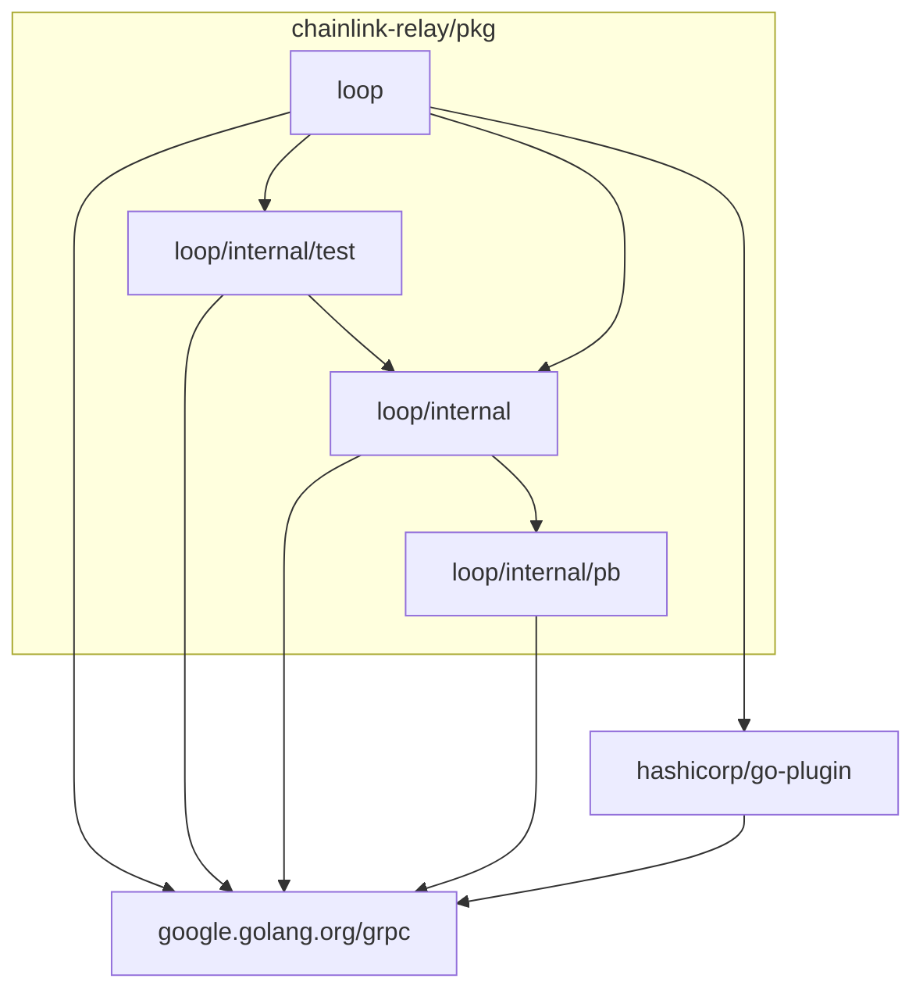

# LOOP Plugins

Local out of process (LOOP) plugins using [github.com/hashicorp/go-plugin](https://github.com/hashicorp/go-plugin).

## Packages

### `package loop`

Public API and `hashicorp/go-plugin` integration.

### `package test`

Testing utilities.

### `package internal`

GRPC client & server implementations.

### `package pb`

Protocol buffer definitions & generated code.
