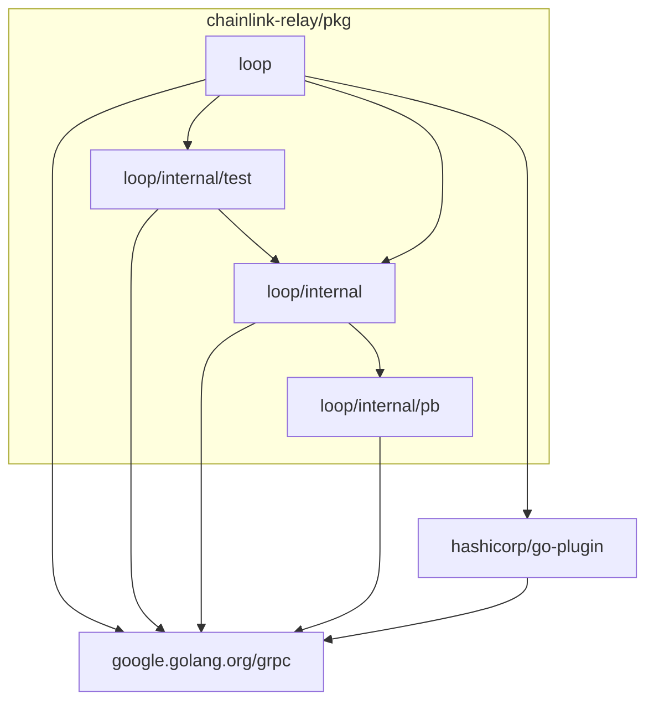
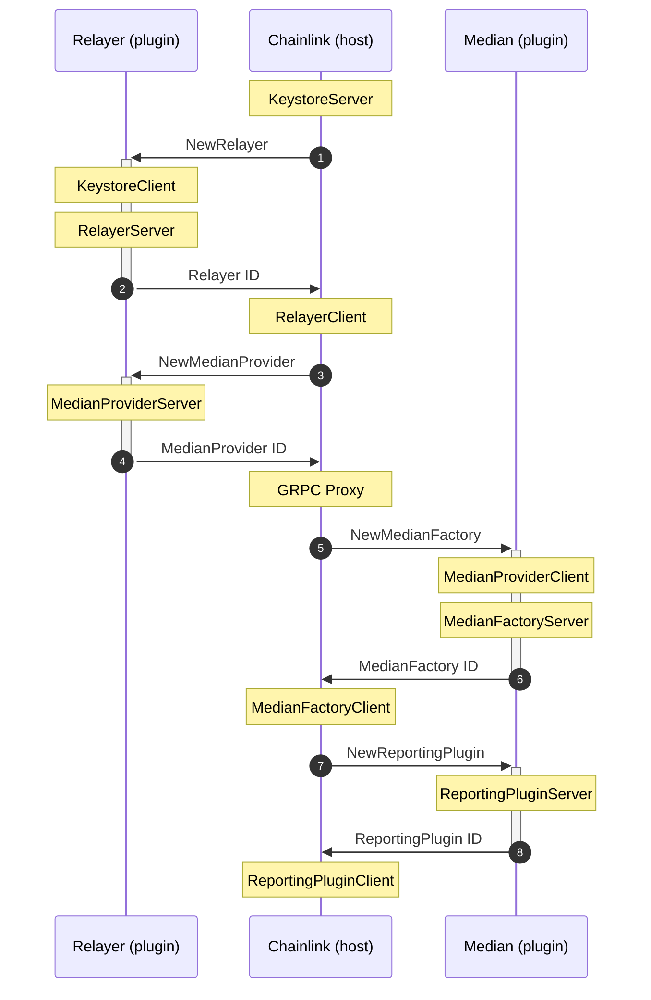

# LOOP Plugins

Local out of process (LOOP) plugins using [github.com/hashicorp/go-plugin](https://github.com/hashicorp/go-plugin).

## Packages

### `package loop`

Public API and `hashicorp/go-plugin` integration.

### `package test`

Testing utilities.

### `package internal`

GRPC client & server implementations.

### `package pb`

Protocol buffer definitions & generated code.

## Communication

GRPC client/server pairs are used to communicated between the host and each plugin.
Plugins cannot communicate directly with one another, but the host can proxy a connection between them.

Here are the main components for the case of Median:  
