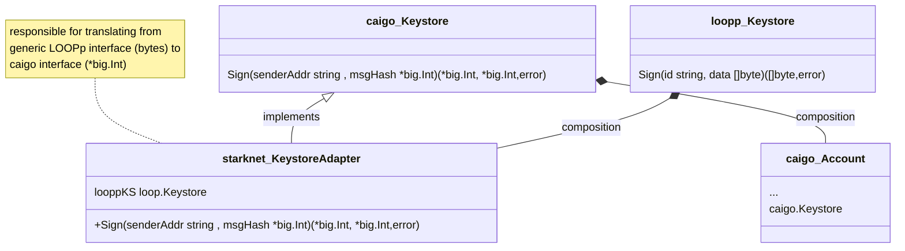

# Staknet LOOP Plugin

:warning: WIP, Experimental :warning:

## Background

This README is a temporary stop gap to capture the design design choices in the starknet stack that 
are not obvious from reading the code. 

For information about LOOP Plugings in general, see `plugins/README.md` and the CLIP

## LOOP Relayer summary

For our purposes, the key points about LOOP Plugins are:

- Node configuration determines which LOOPps are launched
- Orchestration between the node and LOOPps is facilitated by a common api
    - Each LOOPp implementation needs to implements a factory function that instatates a LOOPp-specific implementation of the api
    - The factory function itself is part of the api and therefore must have a common signature amongst all LOOPp implementations
- Each LOOPp relayer implementation must be able to sign transactions
- *All of the above imply a requirement for a common, abstract keystore in the node-LOOPp API* 

### Starknet Signing

The existing `caigo` library passes around private keys in it's API. An explicit private key is required to create an `account` and
an `account` is needed to `Sign` a transaction.

Given this, and the requirement above, our choices are 
- Expose private keys via our abstract keystore
- Change `caigo`
- ? something else that I haven't thought about... open to ideas 

Exposing private keys is both an anti-pattern and a long term risk that we want to avoid. As such, we have choosen to change `caigo`.
By happenstance, we already support our own private fork of `caigo` so there is less friction to implementing this kind of change.

#### Keystore design

There are three layers to the problem, starting at the top of the stack:

1. The starknet LOOPp implementation must implement a factory functions that accepts the abstract keystore, as discussed above
2. The starknet transaction manager must be changed to operate with this new keystore interface
3. `caigo` must expose an API that the transaction manager can use without requiring explicit private keys

At the top of the stack, the abstract keystore, everything is bytes. This enables it to be generic and implementable in each LOOPp. At the 
bottom of the stack, `caigo` the signature algorithms use a `*big.Int` types as dictated by the starknet curve. Given these observations,
the most natural layering is to change `caigo` to support a Keystore that operates on `*big.Int` and use our Transaction Manager
implementation to adapt from the generic LOOPp Keystore to the specific `caigo` Keystore.

