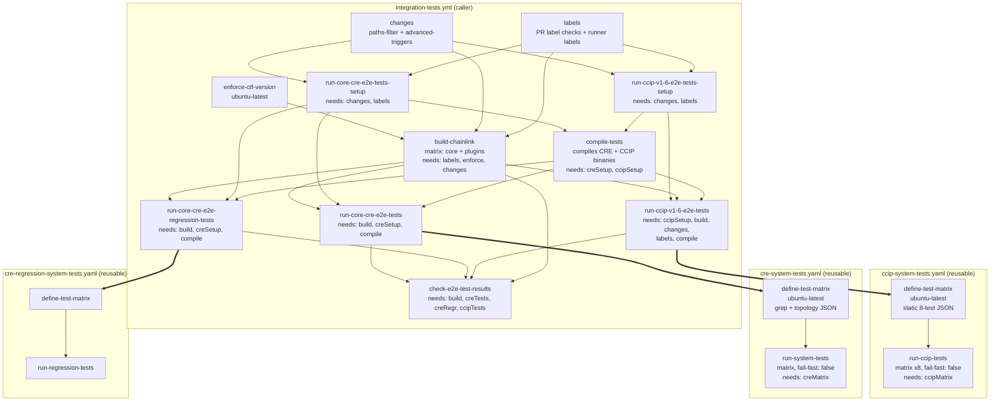
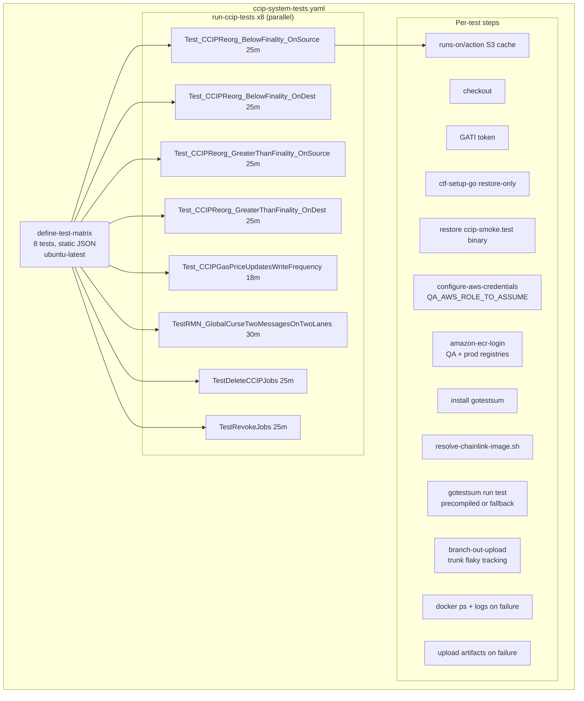

# Simplify CCIP Integration Tests — Action Plan

## Architecture



## CCIP Reusable Workflow Internal Flow



---

## 1. What can be cut or simplified

### A. `define-test-matrix` checkout is unnecessary

The matrix is a hardcoded JSON string — no repo files needed. The checkout step (`ccip-system-tests.yaml:69-73`) serves no purpose.

**Action:** Remove checkout from `define-test-matrix`.

### B. `define-test-matrix` 2-job pattern is minimum

CRE needs a separate job because it greps `_test.go` files for test names. CCIP's matrix is static. GitHub Actions doesn't support dynamic matrix from a single job's step, so the 2-job pattern is the minimum.

**Action:** Keep 2-job pattern, but remove checkout (see A).

### C. GATI token step is likely unnecessary for CCIP tests

GATI provides a GitHub token for pulling private Go modules from GitHub. The `compile-tests` job already downloads modules. The test runner only needs Go for `gotestsum` install and the fallback `go test` path. If the precompiled binary is always present (which it should be in CI), Go is only needed for `gotestsum` — a public package.

**Action:** Can cut GATI if precompiled binary is guaranteed. Keep for now as safety net.

### D. `ctf-setup-go` is heavy for just installing `gotestsum`

If precompiled binary exists, Go is only needed to `go install gotestsum@v1.13.0`. Full `ctf-setup-go` with module cache restore is overkill. Could use `actions/setup-go` with `cache: false` instead. But the fallback `go test` path needs the full module cache, so this is a safety net.

**Action:** Low priority — keep for robustness.

### E. `resolve-chainlink-image.sh` step could be simplified

The script resolves an ECR image from inputs. For `ecr: "sdlc"` (always the case from the caller), this is just:

```
${QA_AWS_ACCOUNT_NUMBER}.dkr.ecr.${QA_AWS_REGION}.amazonaws.com/${chainlink_image_repository_path}:${chainlink_image_tag}
```

Could inline this as a workflow env var instead of a separate step + script call.

**Action:** Minor, but removes a step.

### F. `check-e2e-test-results` in the caller is repetitive

4 identical steps checking `job.result` for failure/cancelled/skipped. Could be a single step that loops over results.

**Action:** Caller change, not CCIP workflow.

### G. `run-ccip-v1-6-e2e-tests` needs list is bloated

The caller job `needs: [run-ccip-v1-6-e2e-tests-setup, build-chainlink, changes, labels, compile-tests]` — but `changes` and `labels` are already transitive deps via `run-ccip-v1-6-e2e-tests-setup`. The job only uses `run-ccip-v1-6-e2e-tests-setup.outputs.should-run` — it doesn't read `changes` or `labels` outputs directly.

**Action:** Can drop `changes` and `labels` from needs.

### H. `E2E_FAST_FILLER_IMAGE` env var is unused

Research showed `ccip-fast-transfer-filler` has no in-repo caller in smoke tests.

**Action:** Cut it.

### I. `workflow_dispatch` inputs duplicate `workflow_call` inputs

Same pattern as CRE, idiomatic for this repo.

**Action:** Keep for consistency.

---

## 2. What can be done to make it more efficient and faster

### A. Merge `define-test-matrix` into caller's setup job

Currently: `ccip-setup` -> `compile-tests` -> `ccip-tests` (calls reusable) -> `define-test-matrix` -> `run-ccip-tests`.

The `define-test-matrix` job adds a full runner startup + checkout cycle (~30-60s) just to output a static JSON string. The matrix could be passed as a `workflow_call` input from the caller, computed in the setup job.

**Impact:** Saves one runner startup cycle.

### B. Parallelize GATI + AWS credential setup

Currently sequential: GATI -> Go setup -> cache restore -> AWS creds -> ECR login -> gotestsum -> resolve image -> run test. GATI and AWS creds are independent. More practically, `resolve-chainlink-image` could run earlier since it only needs env vars, not Go.

**Impact:** Minor — saves a few seconds of sequencing.

### C. Reduce runner size for lighter tests

All 8 tests use `cpu=8/ram=64`. The jobspec tests (`TestDeleteCCIPJobs`, `TestRevokeJobs`) and gas price updates test are lightweight — likely don't need 64GB RAM. Could use `cpu=4/ram=16` for those.

**Impact:** Saves cost, faster spot runner acquisition.

### D. Pre-pull Docker images

Tests spend significant time pulling `postgres`, `ethereum/client-go`, `parrot`, etc. from ECR. Could add a `docker compose pull` step that pre-pulls all required images in parallel before the test runs.

**Impact:** Shaves 1-3 minutes per test.

### E. Cache `gotestsum` binary

`go install gotest.tools/gotestsum@v1.13.0` runs on every test job. Could cache `$(go env GOPATH)/bin/gotestsum` or download the release binary directly.

**Impact:** Saves ~15-30s per job.

### F. Share a single runner for sequential lightweight tests

`TestDeleteCCIPJobs` and `TestRevokeJobs` both use `SIMULATED_1,SIMULATED_2` and are fast. Could group them into a single test job that runs both sequentially, reducing runner count from 8 -> 7.

**Impact:** Saves one runner startup.

### G. Compile-tests: cache key alignment

Already done well. The parallel subshell compilation is good. Cache save steps run unconditionally — minor.

**Impact:** Minimal.

---

## Summary — recommended actions, ranked by impact

| Priority | Change | File | Impact |
|---|---|---|---|
| **High** | Remove checkout from `define-test-matrix` | ccip-system-tests.yaml | -30s runner startup, no functional change |
| **High** | Drop `changes` + `labels` from `run-ccip-v1-6-e2e-tests` needs | integration-tests.yml | Removes unnecessary dependency edges, faster scheduling |
| **High** | Cut `E2E_FAST_FILLER_IMAGE` env var | ccip-system-tests.yaml | Dead code removal |
| **Medium** | Inline `resolve-chainlink-image` as env var, drop step | ccip-system-tests.yaml | -1 step, simpler |
| **Medium** | Cache gotestsum binary or download release | ccip-system-tests.yaml | -15-30s x8 jobs |
| **Medium** | Pre-pull Docker images in parallel before test | ccip-system-tests.yaml | -1-3min x8 jobs |
| **Low** | Reduce runner size for lightweight tests | ccip-system-tests.yaml | Cost savings |
| **Low** | Group jobspec tests into one job | ccip-system-tests.yaml | -1 runner |
| **Low** | Simplify `check-e2e-test-results` to single loop | integration-tests.yml | -40 lines |
