# backlog-flaky-test-pipeline

This **Agent skill** automates an end-to-end flaky-test workflow: discover work (JIRA backlog or explicit tickets, or local test names), gather Trunk/diagnose evidence, run a structured investigation with classification and multi-role debate, optionally apply and verify fixes, then commit and open a PR with JIRA follow-up. **Local mode** skips JIRA/Trunk/PR and stops after verification with uncommitted diffs.

**Model tiers** appear in each phase’s front matter as `model_tier`.
They align with the skill’s `<model-assignment>` shorthand:
- **lightweight** (mechanical branching, API calls — *haiku*, *gemini flash*, *etc*),
- **standard** (code understanding and judgment — *sonnet*, *gemini pro*, *etc*),
- **reasoning** (adversarial debate roles — *opus*, *gemini ultra*, *etc*).

---

## High-level flow

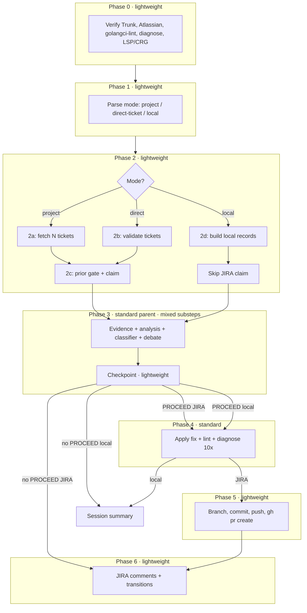

---

## Phase 0 — Prerequisites

`model_tier: **lightweight**`

Mermaid labels below avoid nested backticks and leading `--` inside `"{...}"` diamonds (some renderers treat that as a comment or break lexing).

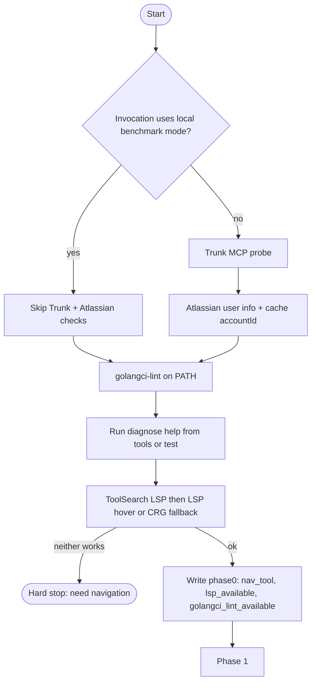

---

## Phase 1 — Invocation & routing

`model_tier: **lightweight**`

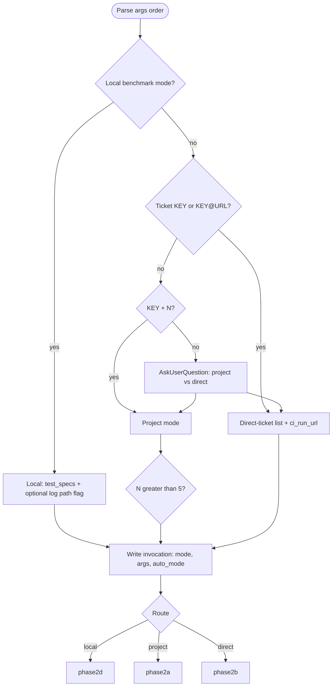

---

## Phase 2a — Project mode (fetch)

`model_tier: **lightweight**` · subagent `fetch-filter`: **lightweight**

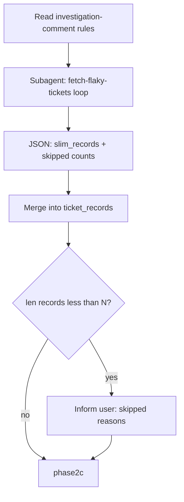

---

## Phase 2b — Direct-ticket mode (validate)

`model_tier: **lightweight**` · subagent `validation`: **lightweight** (one per ticket, parallel)

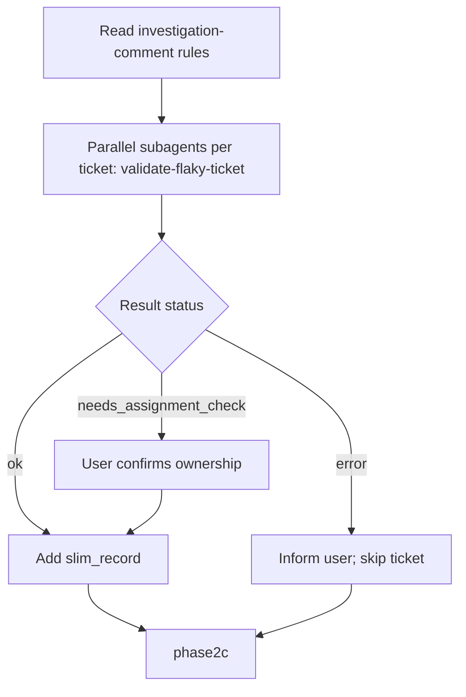

---

## Phase 2c — Prior-investigation gate & claim

`model_tier: **lightweight**`

If **claim-ticket** yields **no** claimed issues (every candidate skipped at the prior gate or not approved), the workflow stops—there is nothing left to investigate.

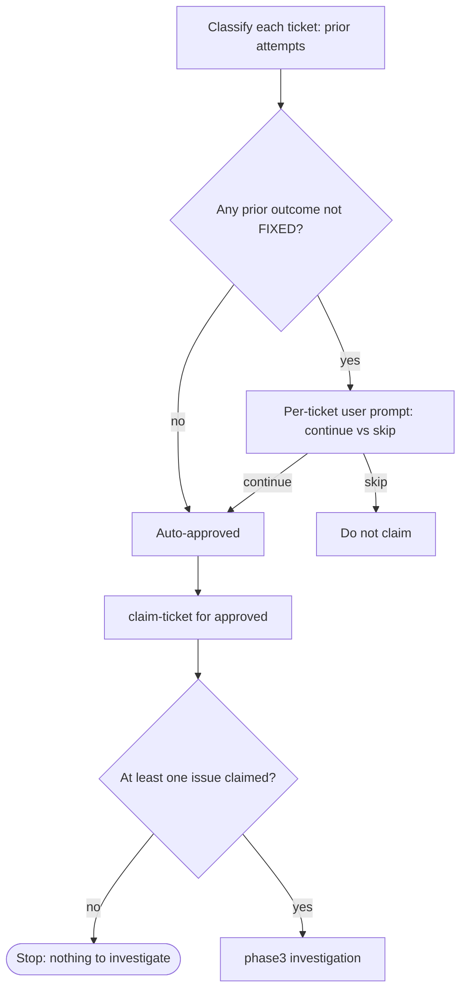

---

## Phase 2d — Local mode (slim records)

`model_tier: **lightweight**`

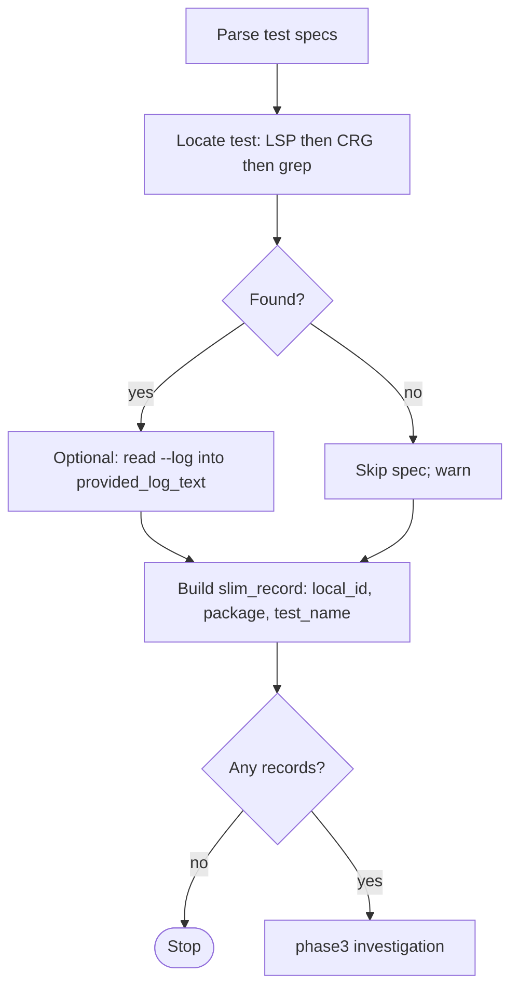

---

## Phase 3 — Investigation (evidence → fix proposal)

**Parent** `model_tier: **standard**` · **3a** substeps **lightweight** · **3b** code-analyzer **standard** · **3b-ii** classifier **standard** (parent) · **3c** **standard** · **3d** Proposer **standard**, Challenger **reasoning**, Arbiter **reasoning** · **Checkpoint** **lightweight**

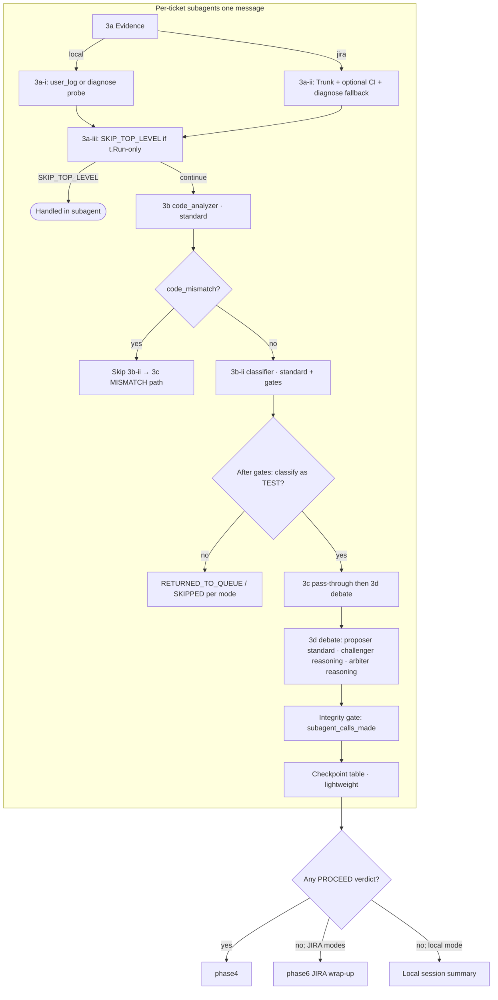

---

## Phase 4 — Apply & verify

`model_tier: **standard**` · subagent `verification`: **standard** · **4a** ownership recheck runs in parent (JIRA only)

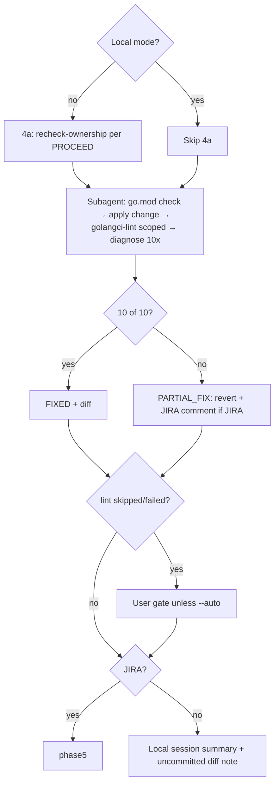

---

## Phase 5 — Commit & PR

`model_tier: **lightweight**`

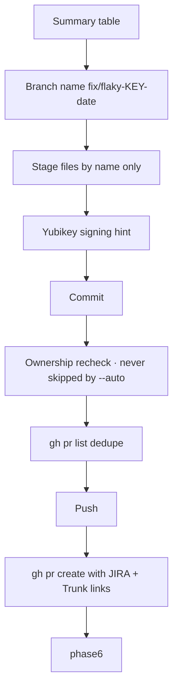

---

## Phase 6 — JIRA terminal update

`model_tier: **lightweight**`

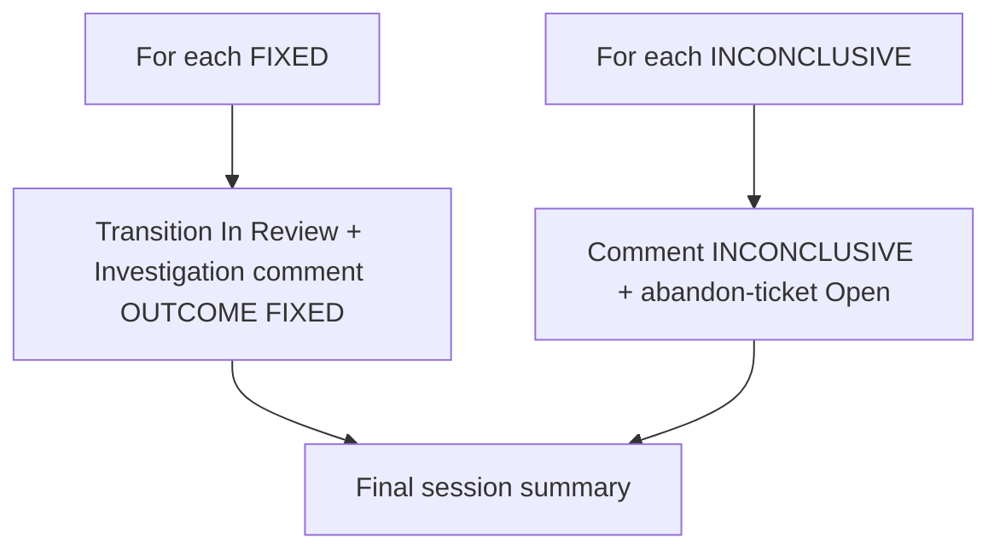