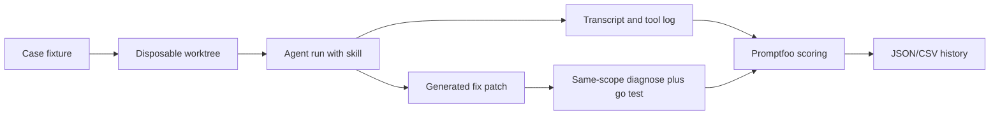

Eventual plan to add evaluation loops to this skill.

# Skill Evaluation Harness

Build a versioned eval loop around `[tools/test/.agents/skills/chainlink-test-diagnosis/SKILL.md](tools/test/.agents/skills/chainlink-test-diagnosis/SKILL.md)` where each case injects a known flaky, slow, timing-out, or deadlocked test into a disposable Chainlink worktree. The agent must use the skill, gather evidence with `diagnose`, patch the test or code, and prove the fix with the same-scope verification run.

## Tool Roles

Use Promptfoo as the score/report layer. Its docs support custom script providers (`exec: ...`), custom assertion scoring functions from JS/Python files, weighted assertion metrics, and CSV output. That fits an agent wrapper that runs one scenario and emits structured JSON for Promptfoo to score.

Use Harbor Framework as the optional execution layer for isolated agent benchmarks if local orchestration becomes fragile. Assume Harbor means `/harbor-framework/harbor`: agent/model evaluation, benchmark creation, and containerized experiments. Keep first version runnable without Harbor; add Harbor after fixtures and scoring stabilize.

## Scenario Fixture

Store cases under `[.agents/evals/chainlink-test-diagnosis/cases/](.agents/evals/chainlink-test-diagnosis/cases/)`.

Each case should include:
- `case.yaml`: id, category, prompt, target package, expected skill behavior, allowed commands, forbidden commands, expected verification.
- `setup.patch`: patch that introduces the flaky/slow/deadlocking test or broken test helper.
- `gold.md`: root cause, evidence the agent should find, acceptable fixes, unacceptable fixes.
- `verify.sh`: deterministic verification command. Usually same-scope `diagnose` plus narrowed `go test`.
- `score.json`: expected rubric weights and case-specific pass/fail gates.

First fixture set:
- `db_pollution_pass_alone_fail_package`: two tests share a table/global DB record; one pollutes state, target passes alone and fails in package.
- `timeout_waitgroup_never_done`: test deadlocks on `sync.WaitGroup.Wait`; timeout log exposes blocked goroutine.
- `slow_sleep_loop`: test uses fixed `time.Sleep` in polling loop; fix should use eventual assertion or signal.
- `race_shared_map`: test flakes with concurrent map access or inconsistent shared state; `-race` should be used after narrowing.
- `deterministic_compile_failure_skip`: ordinary deterministic failure; skill should not enter multi-run diagnose loop.
- `full_suite_request_skip`: user asks for full-suite CI prep; skill should route to normal test runner.
- `sandbox_postgres_blocked`: `diagnose` hits local Postgres sandbox error; agent should ask user to run or approve unsandboxed execution.
- `many_flagged_tests_narrow`: prebuilt report has many entries; agent should show top-N and ask which target to focus.

## Metrics

Track accuracy with weighted gates:
- Activation: uses the skill for instability cases and skips it for deterministic/full-suite cases.
- Scope: does not run unapproved `./core/...`; starts with single test/package/subtree.
- Command shape: harness flags before `--`; `go test` flags after `--`; package patterns last; captures `--ai-output`.
- Evidence: reads `report.json`, CSV when useful, and targeted `log_files` before fixing.
- Hypothesis: names root cause class and ties it to observed report/log evidence.
- Fix: removes seeded root cause while preserving test goal and assertions.
- Verification: reruns same-scope `diagnose`; target disappears from `flakes`, `failures`, `timeouts`, and `slow`.
- Final state: `git diff` contains only expected fix area; verification command exits 0.

Track speed:
- Wall-clock time per scenario.
- Tool calls per scenario.
- Time until correct hypothesis.
- Time until first patch.
- Number of failed verification loops.

Track context usage:
- Input and output tokens per scenario when telemetry is available.
- Number of files read.
- Lines read from reports/logs.
- Broad repo reads before narrowing.
- Transcript size.

## Scorecard

Use a stable JSON result per case and a Promptfoo summary per run.

Per-case fields:
- `scenario_id`
- `skill_sha`
- `chainlink_sha`
- `model`
- `duration_seconds`
- `tool_calls`
- `input_tokens`
- `output_tokens`
- `diagnose_commands`
- `files_touched`
- `verification_exit_code`
- `verification_report_path`
- `scores` object with weighted 0/1/2 rubric values
- `failure_notes`
- `regression_tags`

Run-level rollup:
- Accuracy score by category.
- Safety gate failures.
- p50/p90 duration.
- p50/p90 token usage.
- Mean files read.
- Regression tags by skill section.

## Workflow

1. Create fixture format and 3 smoke cases.
2. Write `run_case` wrapper:
   - Create temp worktree from current repo.
   - Apply `setup.patch`.
   - Start agent with case prompt and attached skill path.
   - Save transcript, tool calls, final diff, timing, and token stats if available.
   - Run `verify.sh`.
   - Emit per-case JSON.
3. Add Promptfoo config:
   - Provider calls `run_case` through an `exec:` script.
   - Assertions call custom JS/Python scoring over emitted JSON.
   - Metrics are weighted by accuracy, safety, speed, and context.
   - Output writes CSV/JSON for trend tracking.
4. Add optional Harbor runner:
   - Package each case as a benchmark task.
   - Use container/worktree isolation for reproducibility.
   - Compare agents/models/skill versions at scale.
5. Store results under `[.agents/evals/chainlink-test-diagnosis/results/](.agents/evals/chainlink-test-diagnosis/results/)`, grouped by timestamp and skill SHA.
6. Before editing the skill, run smoke. Before accepting major rewrites, run full suite.

## Tracking Cadence

Use three eval levels:
- Smoke: 3 real seeded cases after every skill edit: DB pollution, timeout, deterministic skip.
- Full: 8-12 cases before meaningful rewrites land.
- Regression: cases tied to changed skill sections, such as sandbox handling, timeout playbook, or profile guidance.

## Practical Defaults

Start with deterministic scoring where possible and model-graded scoring only for hypothesis quality. Make final verification binary: seeded failure reproduced before agent run, agent patch applied, same-scope verification passes after run.

Good first target:
- One seeded pass-alone/fail-package DB pollution case.
- One seeded timeout/deadlock case.
- One deterministic failure that must skip the skill.

Acceptance threshold for the first useful baseline:
- No safety gate failures.
- At least 2/3 smoke cases fixed or correctly skipped.
- No unapproved broad `./core/...` runs.
- Verification commands recorded for every non-skip case.
- Context usage captured even if token telemetry is missing.