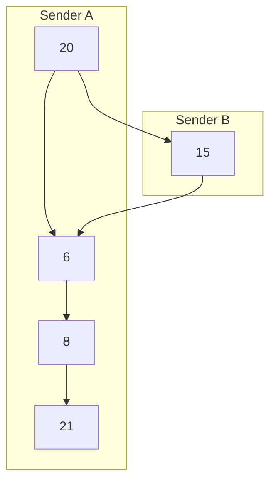
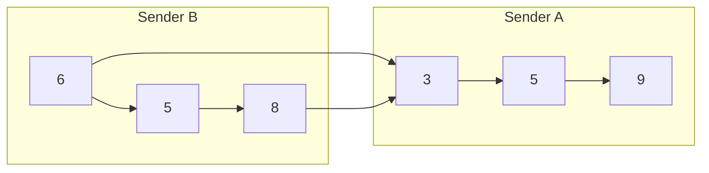
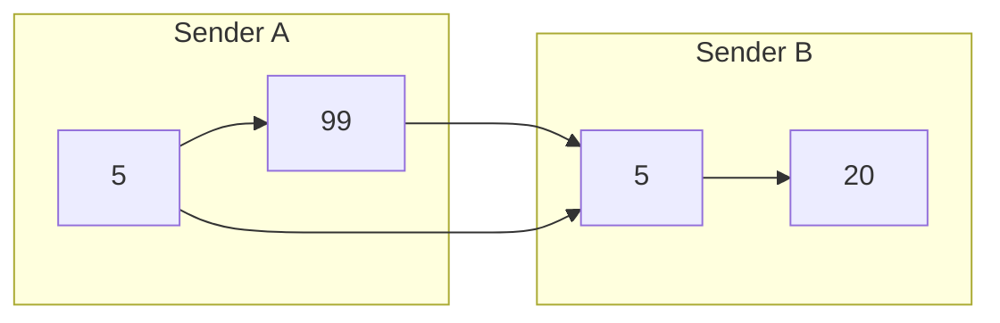
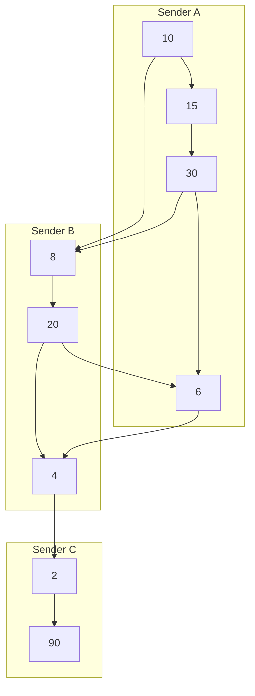

# Priority sender-nonce mempool specification

[priorityNonceMempool](./priority_nonce.go) defines a mempool implementation which stores txs in a partially
ordered set by 2 dimensions: priority, and sender-nonce (sequence number). Internally it uses one priority
ordered skip list and one skip list per sender ordered by sender-nonce. When there are
multiple txs from the same sender, they are not always comparable by priority to other sender txs and must be
partially ordered by both sender-nonce and priority.

The follow rules are strictly observed while iterating the mempool to select transactions:

1) For a given sender their txs must be selected in nonce order. 
2) A transaction with a higher priority is always selected before a transaction with a lower priority except
   when to do so would violate sender-nonce order.

The observance of these rules leads to many interesting cases some of which are outlined below to give an
impression of the prioritization behavior of this mempool.  

In each case mempool order is indicated by a graph where nodes are transactions and edges are dependencies described by 
the two rules for transaction ordering above. The node label indicates the transaction's priority.  Edges within a 
sender satisfy rule 1 (nonce order). Edges between senders satisfy rule 2 (priority order).  A topological sort of the 
graph is a valid mempool order.  

### Case 1

| Sender | Nonce | Priority |
|--------|-------|----------|
| A      | 0     | 20       |
| A      | 1     | 6        |
| A      | 2     | 8        |
| A      | 3     | 21       |
| B      | 0     | 15       |

Mempool order: [20, 15, 6, 8, 21]

Sender A has 4 txs in the pool and sender B only 1.  tx(priority=15) is selected before tx(priority=21) even
though it has a lower priority because it would violate either rule 1 or 2.

### Case 2

| Sender | Nonce | Priority |
|--------|-------|----------|
| A      | 0     | 3        |
| A      | 1     | 5        |
| A      | 2     | 9        |
| B      | 0     | 6        |
| B      | 1     | 5        |
| B      | 2     | 8        |

Mempool order: [6, 5, 8, 3, 5, 9]

Although tx(priority=9) has the highest global priority it is selected last.  This is due tx(priority=3) 
gating 9's selection by rule 1.

### Case 3 - Priority ties

| Sender | Nonce | Priority |
|--------|-------|----------|
| A      | 0     | 5        |
| A      | 1     | 99       |
| B      | 0     | 5        |
| B      | 1     | 20       |

Mempool order: [5, 99, 5, 20]

This case shows how priority ties are handled.  Tx(priority=5, sender=A) is prioritized before tx(priority=5, sender=B) 
because of the transactions following them, tx(priority=99) must be selected before tx(priority=20) by rule 2.

### Case 4

| Sender | Nonce | Priority |
|--------|-------|----------|
| A      | 0     | 10       |
| A      | 1     | 15       |
| A      | 2     | 30       |
| A      | 3     | 6        |
| B      | 0     | 8        |
| B      | 1     | 20       |
| B      | 3     | 4        |
| C      | 0     | 2        |
| C      | 3     | 7        |

Mempool order: [10, 15, 30, 8, 20, 6, 4, 2, 90]

This case shows how the mempool handles a more complex graph with more priority edges between senders.  Again we also demonstrate an idiosyncrasy of this nonce/priroity ordering scheme, tx(priority=90) is selected last because it is gated behind tx(priority=2) by nonce ordering. 
