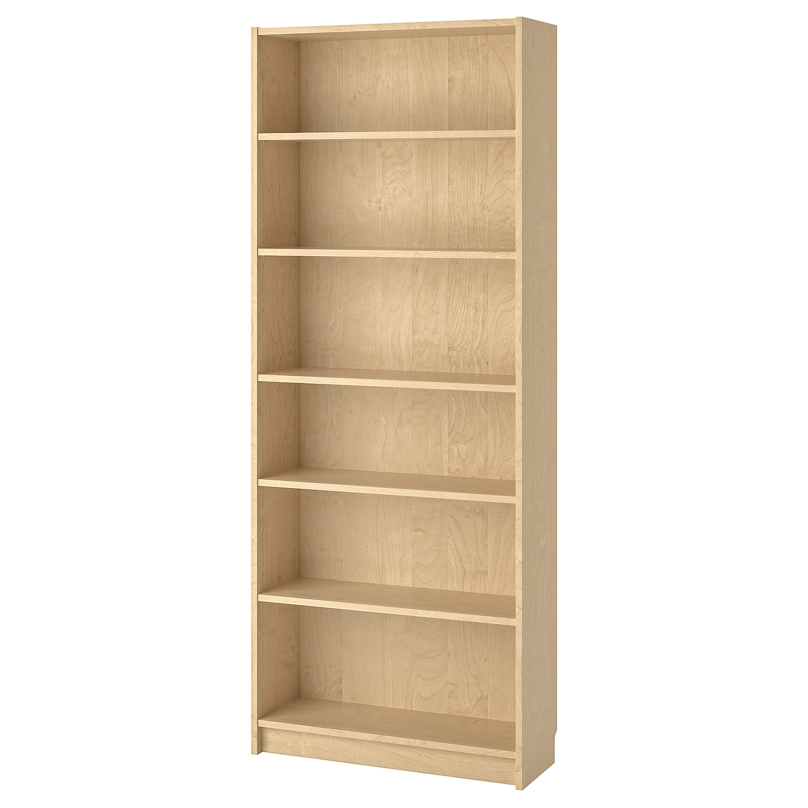
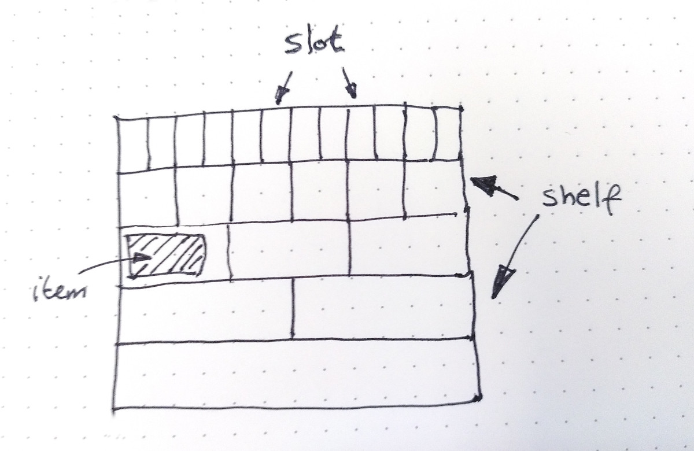

# Billy

[](https://pkg.go.dev/github.com/holiman/billy)
[](https://dl.circleci.com/status-badge/redirect/gh/holiman/billy/tree/main)
[](https://codecov.io/gh/holiman/billy)
[](https://deepsource.io/gh/holiman/billy/?ref=repository-badge)

Billy (previously BagDB) is a super simple datastore. It can't _quite_ be called a database, because it avoids implementing some of the most complex parts of an actual database. 
It's intended to be used in very particular circumstances. 



It is named after the bookcase, because it's very much like a bookcase, with `N` shelves of various heights.

## Cheats

A 'proper' database is very complex, and has to solve several difficult problems: 

- Maintain an index. This serves several purposes: 
  - It decouples the `key`, which is the 'external' identifier, from the actual internal 
  storage representation. This gives the database freedom to store the data 'wherever' it fits best. 
  Having this decoupling means that when elements are deleted, other pieces of data can be moved to overwrite
  the freed element, and the database can be made more compact. 
  - The index allows for the external caller to 'forget' the existence of a piece of data, and later on, when 
  it discovers that it needs the data represented by `key`, it can query the database for it, and the database
  can look it up from disk and hand it back to the process. 
  
### What if? 

But what if we don't need to maintain an index? There are two obvious cavats here: 

- Without an index, we cannot move the data around after it's written. Compaction will not be possible. This can lead to 
fragmentation; where inserts/deletes fragments the buffer space, caused by differently-sized data-chunks, eventually deteriorating 
performance due to many small gaps spread out across the entire storage space. 
- Without an index, the external caller can no longer 'forget' about the data, and later
  query for a specific `key`. This means that the usability is limited to datasets which 
  can be / will be backed by an in-memory reference map. 
  
### What are the upsides? 

- Without an index, we don't need to maintain a complex index-implementation, but can be very low on resource consumption. No 
 extra allocated memory for index maintenance, no background threads for compaction work. 

### In practice

For the [proposal by @karalabe](https://gist.github.com/karalabe/821a1cd0270984a4198e904d34623b6c) about implementing a disk-backed transaction pool for [geth](https://github.com/ethereum/go-ethereum), 
we have very special circumstances: 

- The disk-backed storage is indeed backed by an in-memory structure of metadata. 
- The payloads will roughly equally heavy on `write`, `delete` and `read` operations.
- The data is somewhat transient, meaning that it's expected that the mean-storage time for a piece of data
 is measured in minutes rather than weeks. 
 
 ## Implementation
 
 The `bagdb` uses has the following API:
 
 - `Put(data []byte) uint64`. This operation stores the given `data`, and returns a 'direct' reference to where the data is stored. By 'direct', it means that there is no 
 indirection involved, the returned `key` is a direct reference to the `shelf` and `slot` where the data can later be found. 
   - The `billy` uses a set of shelves. Each shelf has a dynamic number of `slots`, where each slot within a `shelf` is a fixed size. This design is meant to alleviate the 
   fragmentation problem: if a piece of `data` is `168 bytes`, and our shelf sizes are `100`, `200`, `400`, `800`, `1600` .... , then `billy` will choose the `shelf` 
   with `200` byte size. The `168` bytes of data will be placed into `shelf` `1`, at the first free slot. 
 - `Delete(key uint64)`. The `delete` operation will simply look up the `shelf`, and tell the `shelf` that the identified `slot` now is free for re-use. It will be overwritten
  during a later `Put`  operation. 
 - `Get(key uint64)`. Again, this is a very trivial operation: find the `shelf`, load the identified `slot`, and return. 
 


### Compaction

Saying that we can't do compaction is not strictly true: there are two things that can be (and are) done to minimize the disk usage. 

- Truncate-on-delete
  - Truncate-on-delete is what it sounds like: when we delete items at the end of the file, we truncate the file. This has a slight performance hit: a normal delete 
   never touches the disk, but only appends to the in-memory `gap` slice. In order to increase the chance for an opportunity to delete, the `gaps` are kept sorted, and 
   we always prefer writing to lower gaps, leaving the higher gaps for later. 
- Compact-on-open
  - Compact-on-open uses the fact that before the external calles is notified about the data content, we have the freedom to reorder the data, and uses this 
  period overwrite any gaps and truncate the underlying file. 


### Data format

The identifer for accessing an item, a `uint64` is composed as follows: 

| bit   | range           | usage                         | 
|-------|-----------------|-------------------------------|
| 0-23  | 24 bits, `16M`  | reserved for future use       |
| 23-35 | 12 bits, `4K`   | `shelf id` - Shelf identifier |  
| 35-63 | 28 bits, `256M` | `slotkey` - slot identifier   |  

The items themselves are stored with `size` as a 32-bit big-endian encoded integer,
followed by the item itself. The 'slack-space' after `size` is _not_ cleared, so
might contain old data.

```
uint32: size | <data>
```
